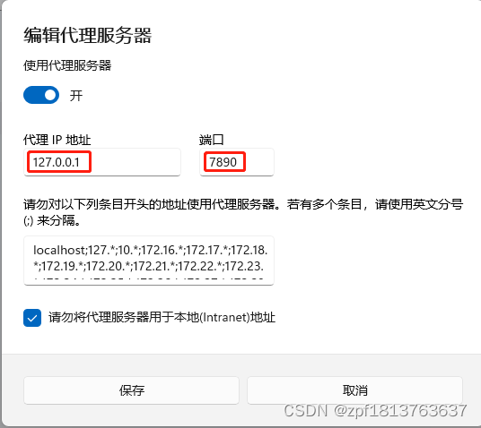

# Git报错： Failed to connect to github.com port 443 解决方案

两种情况：
1. 自己有vpn，网页可以打开github。说明命令行在拉取/推送代码时并没有使用vpn进行代理
2. 情况没有vpn，这时可以去某些网站上找一些代理ip + port

## 针对第一种情况，解放方法如下

配置http代理Windows、Linux、Mac OS中git命令

**配置socks5代理**
```shell
git config --global http.proxy socks5 127.0.0.1:7890
git config --global https.proxy socks5 127.0.0.1:7890
```

**配置http代理**
```shell
git config --global http.proxy 127.0.0.1:7890
git config --global https.proxy 127.0.0.1:7890
```

解读：
1. 命令中的主机号（127.0.0.1）是使用的代理的主机号(自己电脑有vpn那么本机可看做访问github的代理主机)，即填入127.0.0.1即可，否则填入代理主机 ip(就是网上找的那个ip)；
2. 命令中的端口号（7890）为代理软件(代理软件不显示端口的话，就去Windows中的代理服务器设置中查看)或代理主机的监听IP，可以从代理服务器配置中获得，否则填入网上找的那个端口port 


socks5和http两种协议由使用的代理软件决定，不同软件对这两种协议的支持有差异，如果不确定可以都尝试一下
主机号和端口号可在代理的位置查看(自己有vpn的需要查看)



**查看代理命令**
```shell
git config --global --get http.proxy
git config --global --get https.proxy
```

**取消代理命令**
```shell
git config --global --unset http.proxy
git config --global --unset https.proxy
```