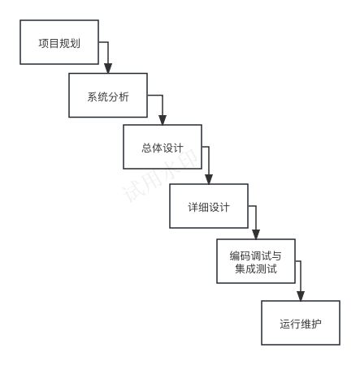
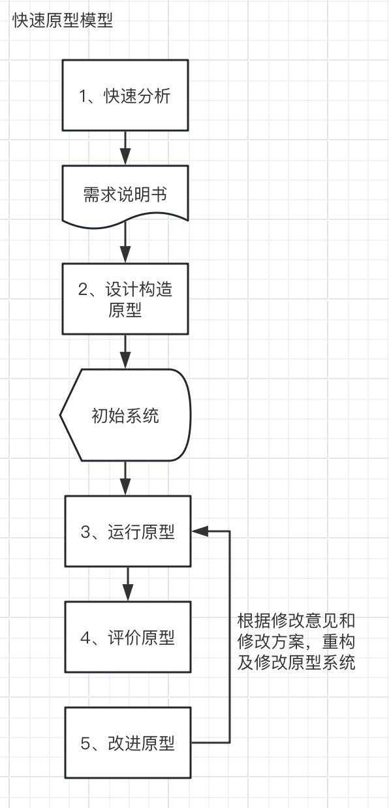
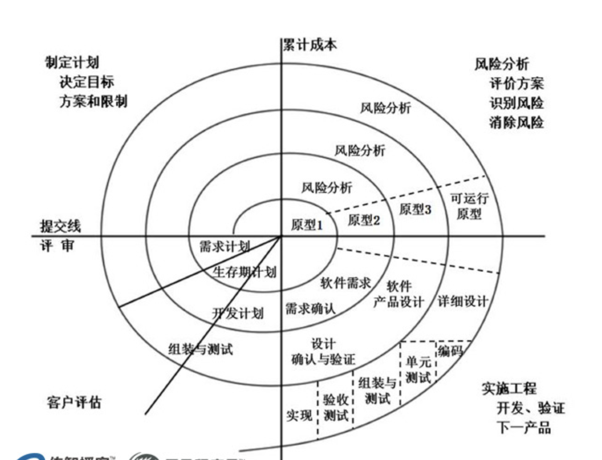
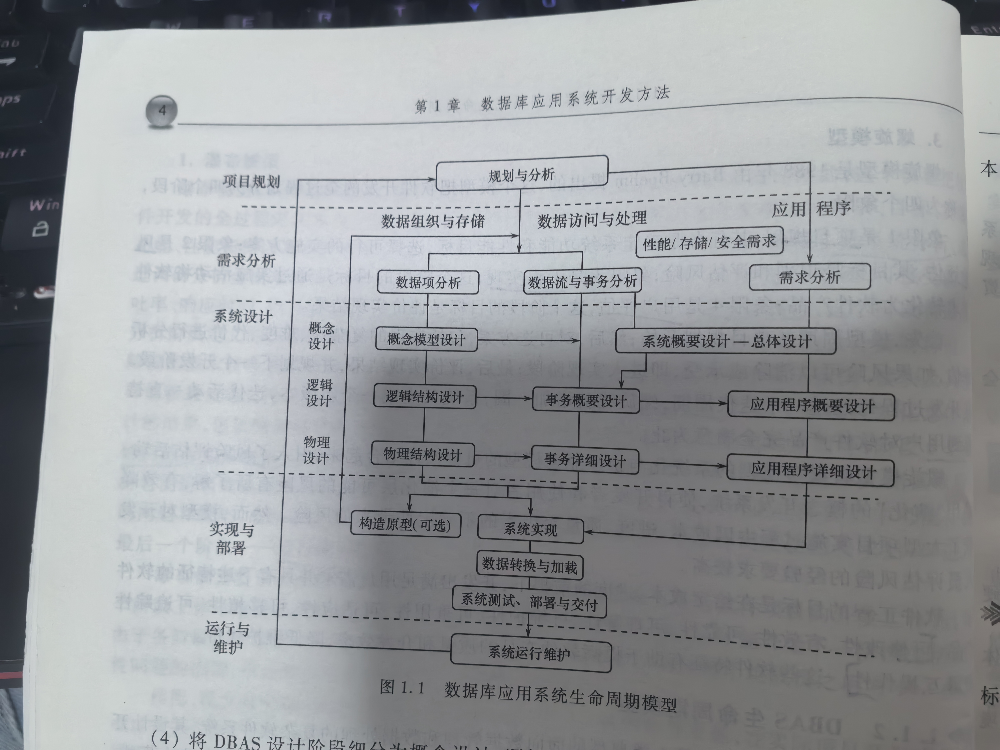
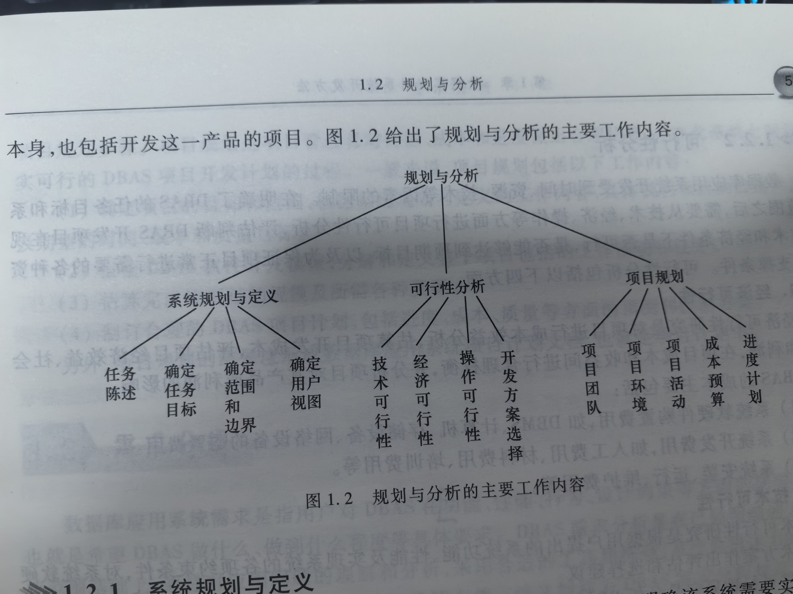
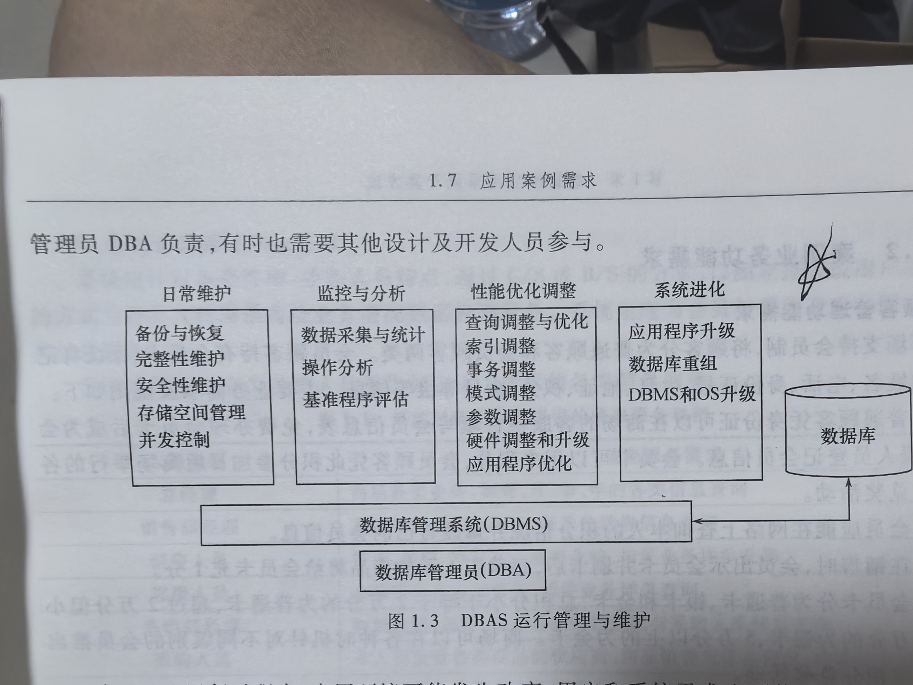

## 专业术语

| 中文 | 英文 | 简称 | 说明 |
| --- | --- | --- | --- |
| 数据库系统 | Data Base System | DBS | 提供应用数据的组织、存储、维护、访问登数据管理功能 |
| 数据库应用系统 | DataBase Application System | DBAS | 不仅为用户提供数据管理功能，还根据具体应用领域业务规划，通过数据库应用程序，实现更为复杂的数据处理功能 |
| 数据库管理系统 | Database Management System | DBMS | 操纵和管理数据库的大型软件，用于建立、使用和维护数据库 |
| 数据库管理员 | Database Administrator | DBA | 从事管理和维护数据库管理系统(DBMS)的相关工作人员的统称，属于运维工程师的一个分支，主要负责业务数据库从设计、测试到部署交付的全生命周期管理 |
| 每秒查询率 | Queries Per Second | QPS | 系统每秒能够相应的查询次数 |
| 每秒处理事务数量 | Transaction Per Second | TPS | 系统每秒能够相应的处理交易或者事务的次数 |

## 1.1 数据库应用系统生命周期

20世纪60年代末至70年代初，诞生了“软件工程”计算机科学技术的新分支。用工程的概念、原理、技术和方法对软件生产、开发的全过程进行跟踪和管理。
软件工程的典型方法：

1. 瀑布模型（也称软件生命周期模型）；
2. 快速原型模型；
3. 螺旋模型。

### 软件工程与软件开发方法

#### 瀑布模型（软件生命周期模型、软件过程模型）

由Winston Royce在20世纪70年代初提出。分为6个阶段：

**1、项目规划**
> 定义开发项目的背景、目标、实现功能、性能指标以及系统需要解决的问题，包括制定合理的项目开发计划。

**2、系统分析**
> 通过调研分析全面理解系统需求，并利用需求说明文档叙述项目目标、功能、适用范围、可接受的吞吐率、响应时间，以及数据的安全性、正确性、有效性等要求。

**3、总体设计**
> 通过这一阶段（总体设计）的设计活动将前一阶段的需求转换成能够实现的软件框架及系统结构，使得系统组成结构中各子系统、模块及其接口能够最佳地支持目标系统的功能需求和性能需求。

**4、详细设计**
> 细化总体设计的结果，包括确定每个模块的算法、结合具体的开发环境设计输入/输出界面等

**5、编码调试与集成测试**
> 将用程序设计语言描述每个模块的求解步骤，通过单元测试以后，将他们组装或集成到软件框架中进行集成测试，通过集成测试发现和纠正软件模块中可能存在的问题和缺陷。

**6、运行维护阶段**
> 运行和维护项目。

瀑布模型要求必须按照模型定义的顺序开展工作，每个阶段结束后必须提交阶段工作文档，并经过严格的评审确认后才能开始下一阶段的活动。

#### 快速原型模型
20世纪80年代中期虽第四代语言及可视化开发工具产生的一种快速开发方法。
指导思想：不必把前期各阶段的活动做的尽善尽美后才启动下一阶段的活动。

分为5各阶段：

**1、快速分析**
> 工作目标：调研分析
> 在获取基本需求的基础上，确定目标系统的功能、界面和性能需求，以此编写基本需求说明书。

**2、设计构造原型**
> 依据需求说明规范，利用可视化集成开发工具快速构建一个可运行的初始系统

**3、运行原型**
> 由用户和相关人员对原型系统进行操作，通过实际操作理解系统，并发现问题。

**4、评价原型**
> 通过审核和评价原型，确认系统存在的问题，提出改进意见，并补充确实需求和因环境变化、需求变动引发的新需求。

**5、改进原型**
> 根据修改意见和修改方案，重构及修改原型系统。重复阶段3到阶段5，直到系统满足需求，修改迭代结束。

#### 螺旋模型

由Barry Boehm在1988提出，划分为4个阶段，也称为4个象限。

> 项目规划 -> 风险评估 -> 工程实现 -> 用户评估。
> 用户评估阶段规划下一个开发阶段，重新走1-4阶段，迭代开发。

**1、项目规划**
> 确定系统功能和性能目标，选择可行的实施方案。

**2、风险评估**
> 目标是识别和评估风险。

**3、工程实现**
> 目标是通过实施活动将软件需求转化为软件产品。

**4、用户评估**
> 目标是评价实现结果

> 软件工程的目标：在给定成本、进度的前提下，开发出满足用户需求并具有可修改性、有效性、可靠性、可理解性、可维护性、可重用性、可适应性、可移植性、可追踪性和可互操作性。
> 这些特征有助于提高软件产品的质量和开发效率。

### DBAS生命周期模型

该模型的基本思想如下：

1. 参照软件开发瀑布模型的原理，DBAS的生命周期由项目规划、需求分析、系统设计、实现与部署、运行与维护五个基本活动组成；
2. 将快速原型模型和螺旋模型的开发思路引入DBAS生命周期模型，允许渐进、迭代地开发DBAS。
3. 根据DBAS的总体目标和实现功能，在模型中引入了数据库设计与实现的内容。即按照数据组织与存储设计、数据访问与处理设计、应用设计三条设计主线，分别设计与实现DBAS中的数据库、数据库事务和应用程序。其中数据库事务设计和应用软件设计属于数据库应用系统功能设计范畴。
4. 将DBAS设计阶段细分为概念设计、逻辑设计、物理设计三个步骤，每一步骤的设计内容又涵盖了三条设计主线。

## 1.2 规划与分析

规划与分析的主要工作内容：

**系统分析：**

1. 任务陈述
2. 确定任务目标
3. 确定范围和边界
4. 确定用户视图

**可行性分析：**

1. 技术可行性
2. 经济可行性
3. 操作可行性
4. 开发方案选择

**项目规划：**

1. 项目团队
2. 项目环境
3. 项目活动
4. 成本预算
5. 进度计划

### 系统规划与定义

具体内容：

1. 任务陈述：描述所要开发的DBAS的总体目标；
2. 确定任务目标：明确为了实现任务陈述所规定的系统总体目标，DBAS应该支持的一系列数据管理和数据处理任务与活动；
3. 确定系统范围和边界：系统范围和边界定义了DBAS做什么、不做什么、做到什么程度，是DBAS需求分析和系统设计等后续开发步骤的设计依据。软件范围指一个软件应该实现的功能、性能边界。
4. 确定用户视图。根据DBAS中用户对数据库的存取需求，对用户进行分类，明确每类用户需要访问数据库中的哪些数据以及如何使用这些数据，组成用户所对应的用户视图。

### 可行性分析

1. 经济可行性：对项目进行成本效益分析，估算项目开发成本，评估项目经济效益、社会效益和利润。
2. 技术可行性：根据用户提出的系统功能、性能及实现系统的各项约束条件，对系统软硬件和技术方案做出评估和选择建议。
3. 操作可行性：论证是否具备DBAS开发所需要的各类人员资源、软件资源、硬件资源和工作环境等，以及为支持DBAS开发如何去改进加强这几方面的资源。
4. 开发方案选择：目标是提出并评价实现系统的各种开发方案，从中选出一种适用于DBAS软件的开发方案。

### 项目规划

项目规划是项目管理者对资源、成本和进度做出合理估算，并在此基础上制定切实可行的DBAS项目开发计划的过程。

项目规划具体工作内容：

1. 确定项目的目标和范围，根据「系统规划与定义」的工作内容，具体说明项目的最终产品以及期望的时间、成本和质量目标、
2. 根据DBAS软件开发模型，分解和定义整个项目包括的工作活动和任务。
3. 估算完成该项目的规模及所需各种资源。
4. 制定合理的DBAS项目计划，包括进度、成本、质量等方面的预测和控制方案。

产出：DBAS项目计划文档，也就是项目计划书。

## 1.3 需求分析

DBAS需求：是指用户对DBAS在功能、性能、行为、设计约束等方面的期望和要求。
DBAS需求分析规范说明书：在已经明确的DBAS系统范围基础上，通过对应用问题的理解和分析，采用合适的工具和符号，系统地描述DBAS的功能特征、性能特征和约束所形成的文档。（该文档是DBAS设计和测试阶段的重要依据）
需求分析过程由**需求获取、需求分析、需求描述与规范说明、需求验证**等步骤组成。

### 1.3.1 数据需求分析

数据需求分析是从对数据进行组织与存储的角度，从用户视图出发，分析与辨识应用领域所管理的各类数据项和数据结构，形成数据字典的主要内容。
数据字典包括：数据项、数据结构、数据流、数据存储和处理过程。
> **数据项**是数据的最小组成单位；
> **数据结构**是由若干个数据项组成；
> **数据字典**通过对数据项和数据结构的定义来描述数据流和数据存储的逻辑内容。

### 1.3.2 功能需求分析

功能需求分析四DBAS需求分析的核心环节。功能需求分析总体上课分为： **数据处理需求分析、业务规则需求分析**

#### 数据处理需求分析

数据处理需求分析从数据访问和处理的角度，明确对各类数据项所需进行的数据访问操作，分析结果可表示为数据流图或DBAS应支持的各种数据处理事务规范。
数据流图：一种形式化的数据需求分析技术，利用数据项、数据存储、数据加工和数据流等概念描述对数据的处理。
事务规范包括以下几方面的事务描述信息：

1. 事务名称；
2. 事务描述。指对事务功能、性能、完整性约束等方面的描述；
3. 事务所访问的数据项；
4. 事务用户。指启动该事务执行的事件/用户。

产出：数据字典文档（也称为数据规范说明书）：数据需求分析和数据处理需求分析的结果组织在一起

#### 业务规则需求分析

业务规则需求分析是从DBAS高层目标和整体功能出发，分析系统或系统中一些大粒度子系统应具有的业务类型和功能，明确用户或外部系统与DBAS的交互模式。
「业务规则需求分析」主要面向开发者，分析结果可采用多种方式表述：

1. 自然语言
2. UML
3. 某种特定领域相关的形式化、半形式化描述机制

### 1.3.3 性能需求分析

性能指标：

1. 数据操作响应时间，或数据访问响应时间；
2. 系统吞吐量；系统吞吐量可表示为每秒事务数TPS。
3. 允许并发访问的最大用户数；
4. 每TPS代价值；

影响DBAS性能的主要因素：

1. 系统硬件资源；
2. 网络通信设备性能；
3. 操作系统环境；
4. 数据库的逻辑设计和物理设计质量；
5. DBMS的配置和性能；
6. 数据库应用程序自身。

### 1.3.4 其他需求分析

#### 存储需求分析

估计DBAS系统需要的数据存储量，如DB所存储的数据总量。包括：

1. 初始数据库大小。指DBAS刚投入运行时的数据存储总量；
2. 数据库增长速度。指运行过程中DB内数据量的变化情况。

#### 安全性需求分析

需考虑一下几个问题：

1. DBAS系统应达到的安全控制级别；
2. 各类用户的数据视图和视图访问权限；
3. DBAS应有的口令保护机制或其他安全认证机制，

#### 备份和恢复需求分析

1. DBAS运行过程中备份数据库的时间和备份周期；
2. 所需备份的数据是全部数据库数据，还是其中的一部分；
3. 备份方式是采用完全备份还是采用差异备份。

## 1.4 系统设计

### 1.4.1 概念设计

包括**数据库概念模型设计、系统总体设计**

#### 数据库概念模型设计

依据「数据需求分析」阶段得到的需求规范说明文档，分析辨识需要组织存储在数据库中的各类应用领域数据对象的特征及其相互间关联关系，并采用「概念数据模型」表示出来，得到独立于具体DBMS的「数据库概念模型」。
数据库概念模型：ER方法

#### 系统总体设计

设计原则：**自上而下、由简到繁、逐步求精**
系统总体设计内容：

1. DBAS体系结构设计；
2. DBAS系统硬件平台的选型和配置。操作系统、数据库管理系统等系统软件的选型和配置；
3. 应用软件结构设计。将应用软件划分为一些列软件子系统，定义子系统间的信息交互方式；进一步划分个软件子系统的模块结构；
4. 对需求分析阶段识别出的业务规则进行初步设计，细化业务规则流程，分析所处理的业务数据和处理方式，明确采用的关键技术和算法等；
5. 对系统采用的关键技术进行方案选型和初步设计。

### 1.4.2 逻辑设计

包括**数据库逻辑结构设计、数据库事务概要设计、应用程序概要设计**

#### 数据库逻辑结构设计

「数据库逻辑结构设计」指从数据库的概念模型出发，设计表示为逻辑模式的数据库逻辑结构。

使用ER图设计数据库关系模式。

#### 数据库事务概要设计

「事务概要设计」的任务是根据续期分析阶段识别出的各种DBAS事务，设计与具体DBMS和实现方法无关的事务数据处理流程，明确事务所访问的哥关系表。

#### 应用程序概要设计

将DBAS中的应用软件模块按照逐步求精、信息隐藏和功能细化原则，进一步划分为子模块，组成应用软件的系统 - 子系统 - 模块 - 子模块层子结构。
直接访问数据库的模块/子模块抽象为「数据库事务」

### 1.4.3 物理设计

包括**数据库物理结构设计、数据库事务详细设计、应用程序详细设计**

#### 数据库物理结构设计

数据库中的数据以文件形式存放在物理设备上。

「数据库物理结构」指数据文件在外存上的存储结构和存取方法。

目标：设计一个占用存储少、具有较高的数据访问效率和较低的维护代价的数据库存储模式。
具体内容：

1. 数据库逻辑模式调整
2. 文件组织与存取设计
3. 数据分布设计
4. 安全模式设计
5. 确定系统配置
6. 物理模式评估

#### 数据库事务详细设计

事务详细设计将事务概要设计中的read和write元操作替换为DBMS支持的增、删、改、查等具体数据库访问操作或数据库访问API调用。

#### 应用程序详细设计

根据应用程序概要设计中定义的各模块功能呢输入/输出数据需求，结合具体的程序设计环境和机制没设计各模块的内部处理流程和算法、数据结构、对外详细接口等。

## 1.5 实现与部署

包括以下工作内容：

1. 建立数据库结构；
2. 数据加载；
3. 事务和应用程序的编码及测试；
4. 系统集成、测试与试运行；
5. 系统部署。

## 1.6 运行管理与维护

数据库运行管理所包含的主要工作：

