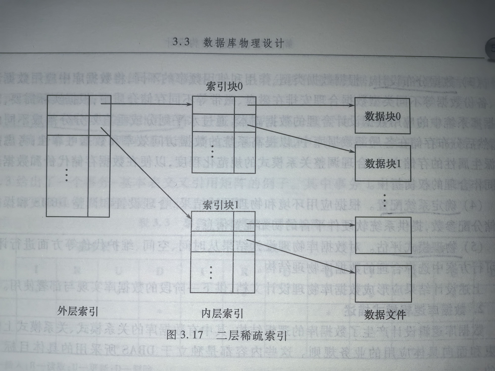

## 专业术语

| 中文 | 英文 | 简称 | 说明 |
| --- | --- | --- | --- |
| 实体联系 | Entity Relationship | ER | 一种建模方法 |
| IDEF1X | |  | 一种建模方法 |
| 3NF | 3NF |  | 数据库设计时遵循的一种规范。1NF：对属性的原子性约束，要求属性具有原子性；2NF：是对记录的惟一性约束，要求记录有惟一标识，即实体的惟一性；3NF是对字段冗余性的约束，即任何字段不能由其他字段派生出来，它要求字段没有冗余 |

## 3.1 数据库概念设计

### 3.1.1 概念设计的任务

数据库概念设计任务：理解和获取应用领域中数据需求，分析、抽取、描述和表示清楚目标系统需要存储和管理什么数据，这些数据具有什么样的属性特征及组成格式，数据之间存在什么样的依赖关系。

数据库概念设计阶段的目标：

1. 定义和描述应用领域设计的数据范围；
2. 获取应用领域或问题域的信息模型；
3. 描述清楚数据的属性特征；
4. 描述清楚数据之间的关系；
5. 定义和描述数据的约束；
6. 说明数据的安全性要求；
7. 支持用户的各种数据处理需求；
8. 保证信息模型方便地转换成数据库的逻辑结构（数据库模式），同时也便于为用户理解。

### 3.1.2 概念设计的依据及过程

** 1. 概念设计的依据 **

数据库概念设计的依据：需求分析阶段的文档，包括需求说明书、功能模型（数据流程图或IDEF0图）以及在需求分析阶段收集到的应用领域或问题域中的各类报表等。

数据库用户确认数据需求的依据：**信息模型**和**数据库概念设计说明书**

** 2. 概念设计的过程 **

1. 明确建模目标
> 明确建模目标，确定模型覆盖的问题范围，这有助于建模人员表识所关心的数据

2. 定义实体集
> 这个阶段的目标：标识和定义应用领域中的实体集。
> 工作的基础：需求分析阶段得到的功能模型DFD图、需求说明书以及需求分析阶段收集到的原始单据、统计报表、表格等。
> 需求分析阶段的工作方式：自顶向下、逐步求精；
> 数据库概念设计阶段的工作方式：自底向上

定义实体集简单的方法 **分类标识、概括命名**
分类标识：按照具有相同属性特征原则归类；
概括命名：对分类精选概括命名，使用实体集名词

区别实体集名词和非实体名词的方法是考察实体集名词是否具有以下特征：

1) 它能够被描述或说明吗？
2) 有多个同类的实例吗？
3) 每个实例可以被标识和区分吗？

3.定义联系

标识实体集之间关系的方法： **联系矩阵**
> 定义联系的工作主要包括：表示依赖、命名联系及关于联系的说明
> 联系命名：动词或动词短语。规则是：从父到子（自顶向下）或从左到右说明
> 联系命名要求：定义的联系名必须是具体的、简明的和有意义的。

确定实体集之间联系的基数：
> 在联系的两端进行；
> 先看联系一端的实体集，假设这个实体集的一个实力存在，分析相对于这个实体集来说，联系另一端即第二个实体集存在多少个确定的实例。然后调换进行，重复分析。

4. 建立信息模型

> 根据标识定义的实体集、联系及实体集之间联系的基数，选择一种建模方法（ER方法，构造ER模型）
> 从局部到子系统入手，先建立局部信息模型，然后再综合成为总体信息模型。

5. 确定实体集属性

> 属性：用来描述一个实体集的特征或性质。
> 属性 = 属性名 + 类型 + 长度

6. 对信息模型进行集成与优化

### 3.1.3 数据建模方法

建模方法有：ER模型（实体联系模型）、IDEF1X、UML中的类图

这些建模方法的共同特点：

1. 能够真是客观地描述现实世界中的数据及数据之间的关系；
2. 组成模型的概念少，语义清楚，容易理解；
3. 不同概念的语义不重叠，概念无多义性；
4. 用图形方式描述数据，数据直观易懂，有利于数据库设计者和用户交流；
5. 容易转换成数据库逻辑设计阶段需要的数据结构

**1.ER建模方法**

概念：

1. 实体或实例（个人理解：类的实例）：指客观存在并可相互区分的事物；
2. 实体集（个人理解：类）：表示一个显示的和抽象事物的集合，这些事物必须具有相同的属性或特征；
3. 属性（个人理解：类的属性）：描述一个实体集的性质和特征；
    > 属性域：属性的取值范围；
    > 属性值：属性的具体取值；
4. 码（个人理解：唯一值，id）：实体集中能唯一标识每一个实例的属性或属性组；
5. 联系（个人理解：外键）：描述显示世界中事物之间的关系；
    > 一对一联系：系和系主任，一对一联系(1:1)；
    > 一对多联系：系和学生，一对多联系(1:n)；
    > 多对多联系：学生和课程，多对多联系(m:n)；

图形说明：

1. 矩形框：表示实体集，矩形框内写上实体集名称；
2. 菱形：表示联系，菱形内写上联系名称；
3. 椭圆或圆角矩形：标识实体集的属性，椭圆或圆角矩形内写上属性名

**2.IDEF1X建模方法**

IDEF1X：数据建模方法，侧重分析、抽象和概括应用领域中的数据需求；
IDEF0：功能建模方法，侧重描述系统功能需求；

建模元素：

1. 实体集：
    > 独立实体集：实体集的每个实例都能被唯一地标识而不取决于它与其他实体集的联系；
    > 从属实体集：实体集的一个实例的唯一标识依赖于该实体集与其他实体集的联系；
2. 联系：
    > 标定型联系：子女实体集中的每个实例都是由它与双亲的联系确定的；
    > 非标定型联系：子女实体集中的每个实例都能被唯一确认而无需了解与之相联系的双亲实体集的实例
    > 分类联系：两个或多个实体集之间的联系，且存在一个「一般实体集」，它的每个实例都恰好与一个且仅一个分类实体集的一个实例相联系。
    > 非确定联系（或称：多对多关系）：任一实体集的一个实例都将对应另一个实体集的0个、1个或多个实例。

图形：

### 3.1.4 概念设计实例

按照建立ER模型步骤：

1. 建模目标；
2. 定义实体集；
3. 定义联系；
4. 建立信息模型；
5. 确认实体集属性；
6. 对信息模型进行集成与优化。

## 3.2 数据库逻辑设计

### 3.2.1 概述

数据库逻辑设计任务：把数据库概念设计的结果（ER模型），转换为具体的数据库管理系统支持的数据模型。

数据库逻辑设计的依据和阶段目标：

### 3.2.2 逻辑设计实例

详见对应课本章节

## 3.3 数据库物理设计

### 3.3.1 物理设计概述

数据库物理设计的目的：将数据的逻辑描述转换为实际技术规范；
数据库物理设计的目标：设计数据存储方案，以便提供足够好的性能并确保数据库数据的完整性、安全性和可恢复性。

### 3.3.2 数据库物理结构

数据库中的应用数据是以文件形式存储在外设存储介质（如磁盘）上的，文件在逻辑上被组织成记录的序列。

从数据库物理结构角度需要解决如下几个问题：

1. 文件的组织；
2. 文件的结构；
3. 文件的存取；
4. 索引技术。

### 3.3.3 索引

**1.索引技术**

索引概念：索引是关系数据库中对某一列或多个列的值进行预排序的数据结构。如同 书的目录。

索引技术是一种快速数据访问技术。

索引技术的关键：建立记录域取值到记录的物理地址件的映射关系。

**2.索引技术分类**

根据索引的实现方式，可分为有序索引和散列索引，

1. 有序索引（也称：索引文件机制）：
> 查找码：记录域
> 索引项 = [查找码, 物理文件地址]

2. 散列索引（也称：哈希（Hash）索引）：
> 散列索引利用一个散列函数实现「记录域（查找码）」取值到记录物理地址件的直接映射关系。

**3.有序索引**

数据库中的数据文件经常采用顺序文件结构，文件的数据记录按照某个特定的查找码值的升序或降序顺序地存储在文件中。

索引技术的主体 = 数据文件 + 索引文件。
数据文件也成为 被索引文件 或 主文件。

索引文件 是索引记录或索引项的集合。

索引建立在查找码上；
一个数据文件可以有多个查找码和多个索引文件。

根据索引（文件）本身的性质，有一下几类有序索引：

1. 聚集索引和非聚集索引

聚集索引：数据文件和它的一个特定的索引文件，如果<u>数据文件中数据记录的排列顺序与索引文件中索引项的排列顺序一致</u>。（或者：索引文件按照其查找码指定的顺序与数据文件中数据记录的排列顺序一致）
非聚集索引：聚集索引的反之。

2. 稠密索引和稀疏索引

稠密索引：数据文件中的每个查找码值在索引文件中对应一个索引记录的索引；
稀疏索引：只是一部分查找码的值有对应的索引记录的索引。

3. 主索引和辅索引

主索引：在数据文件的主码属性集上建立的索引；
辅索引：在数据文件的非主属性上建立的索引。

4. 唯一索引

唯一索引可以确保索引列不包含重复的值。

5. 单层索引和多层索引

单层索引（也称：线性索引）：索引项根据键值在索引文件的顺序排列，组织成一维线性结构，每个索引项直接指向数据文件中的数据记录；
多层索引：（自己理解：外层索引文件的索引项指向的位置是内层索引文件的地址，再去内层索引查找具体的数据文件中的数据记录）

### 3.3.4 数据库物理设计

**1. 物理设计内容**

数据库物理设计目标：得到存储空间占用少，数据访问效率高和维护代价低的数据物理模式。

影响数据的存储和存取的因素：DBS所依赖的硬件环境、操作系统和DBMS有关。

数据库物理设计环节：

1. 数据库逻辑模式描述：
2. 文件组织与存取设计；
3. 数据分布设计；
4. 确定系统配置；
5. 物理模式评估。

**2. 数据库逻辑模式描述**

数据库逻辑模式描述的主要涉及内容：

1. 面相目标数据库描述基本表和视图；
2. 设计基本表业务规则。

**3. DB文件组织与存取设计**

1. 使用事务-基本表交叉引用矩阵；
2. 估计个事务的执行效率；
3. 对每张基本表，汇总所有作用于该表上的各事务的操作频率信息；

为基本表选择合适的文件结构的原则：

1. 如果数据库中的一个基本表中的数据量很少，并且插入、删除、更新等操作非常频繁，该基本表可以采用**堆文件组织方式**。
2. 顺序文件支持基于查找码的顺序访问，也支持快速的二分查找。如果用户的查询条件定义在查找码上，则顺序文件是比较合适的文件结构。
3. 如果用户查询是基于散列域值的等值匹配，特别是如果访问顺序是随机的，则散列文件比较合适。
    > 散列文件组织不适合：
    > 1/ 基于散列域值的非精确查询（如模糊查询、范围查询）；
    > 2/ 基于非散列域进行的查询。
4. B-树和B+树文件是实际数据库系统中使用非常广泛的索引文件结构，适合于定义在大数据量基本表上、基于查找码的等值查询、范围查询、模糊查询和部分查询。
5. 如某些频繁执行且需要进行多表连接操作的查询，可考虑将这些基本表组织为聚集文件，以改善查询效率

对于基本表，可考虑在下面一些属性上建立索引：
1. 表的主码
2. 在where查询子句中引用率高的属性
3. 参与连接操作的属性
4. 在order by子句，Group by子句中出现的属性
5. 在某一范围内频繁搜索的属性，但只有当使用索引的查询其结果不超过记录总数的20%时，索引才会有明显的效果
6. 如果在where自居中同时包含一个表中的多个属性，可以考虑在这些属性上建立多属性索引
7. 当一个属性有相对较多的不同值时，使用索引有明显的作用；当一个属性的不同值很少时，使用索引没有好处
8. 对包含大量空值的属性建立索引是要仔细考虑，因为很多数据库管理系统中的索引不引用具有空值的行，对空值的查找需要使用全表扫描来实现。

**4. 数据分布设计**

1. 不同类型数据的物理分布

2. 应用数据的划分与分布

根据数据的使用特征划分
根据时间、地点划分
分布式数据库系统重的数据划分

3. 派生属性数据分布

4. 关系模式的去规范化

### 3.3.5 其他物理设计环节

合理的参数设置可以提高数据库的存储和查询效率