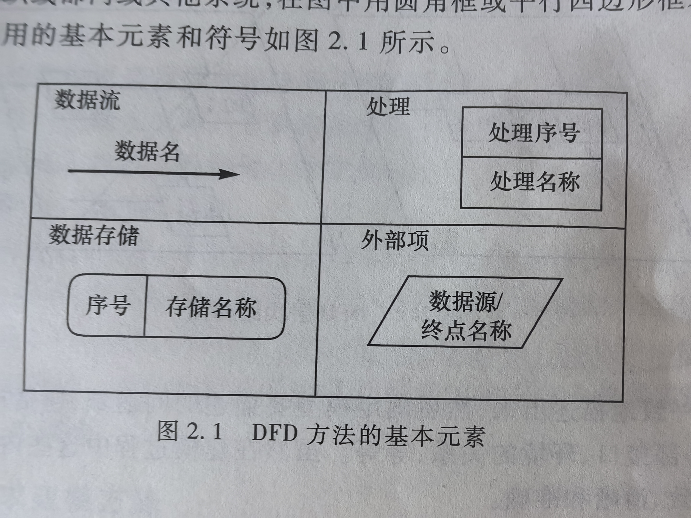
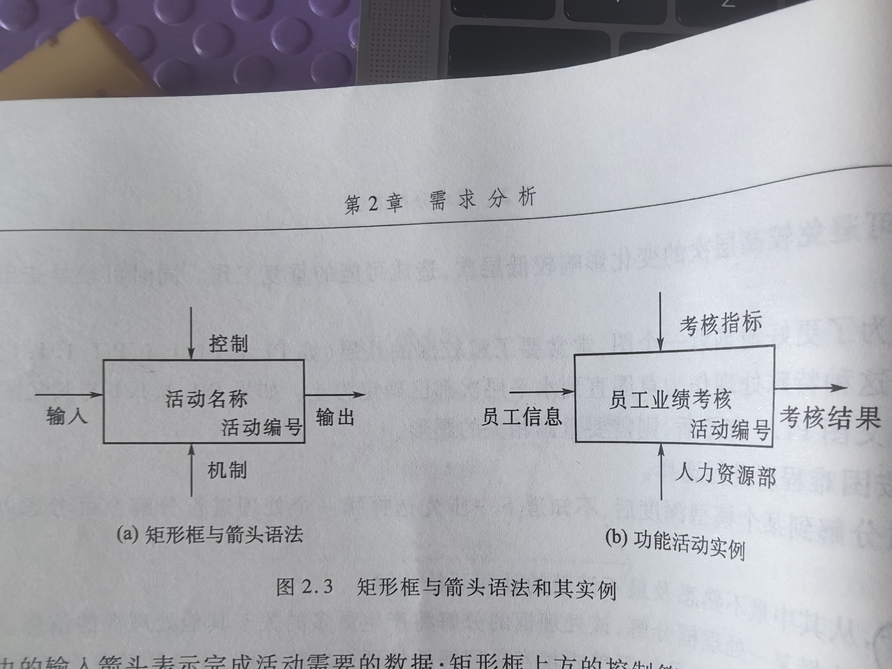
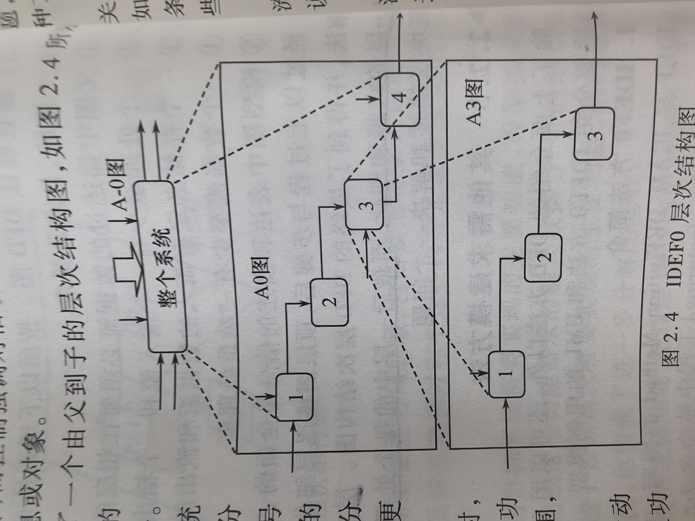
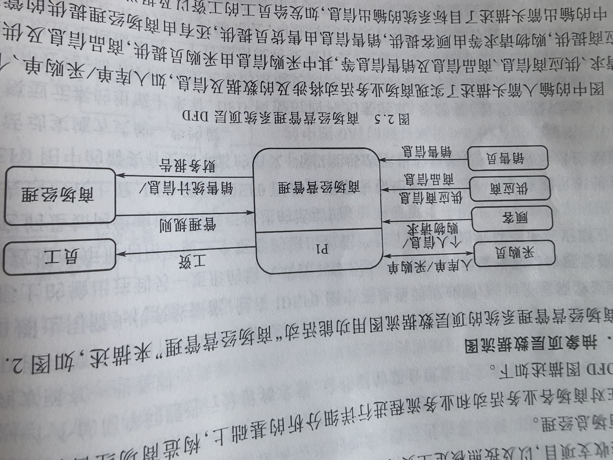
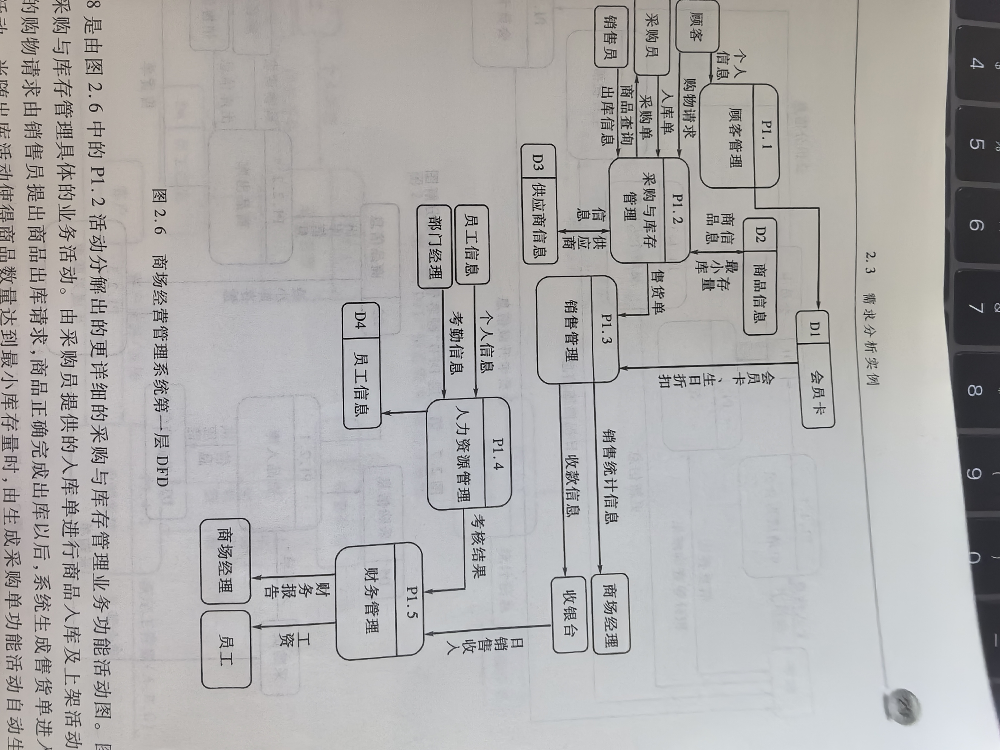
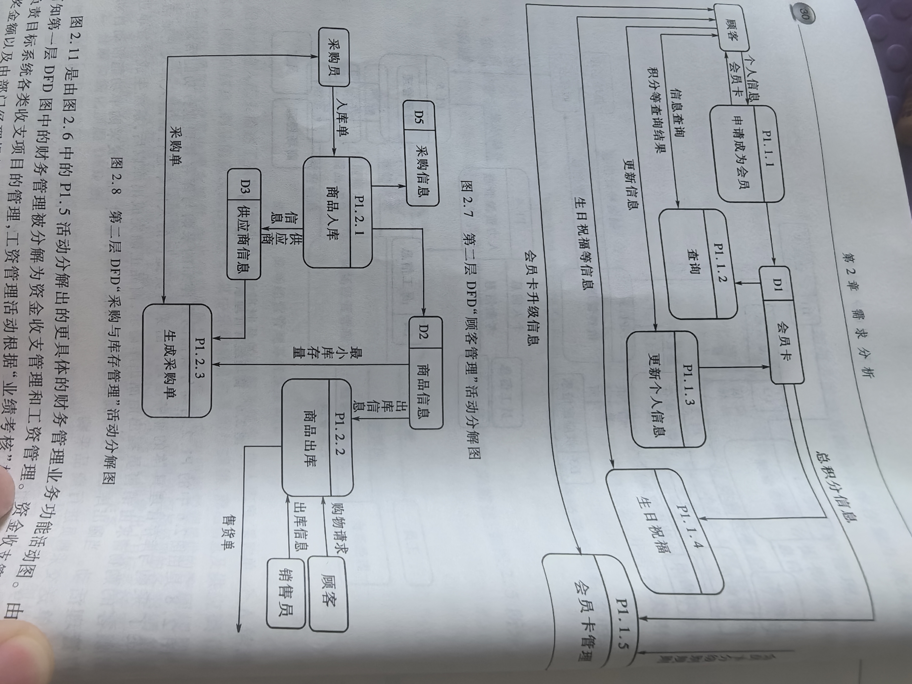
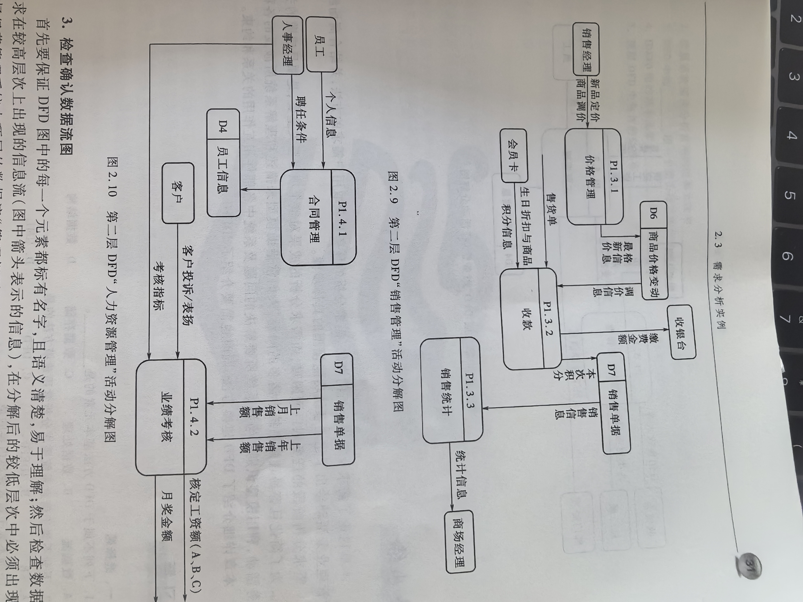
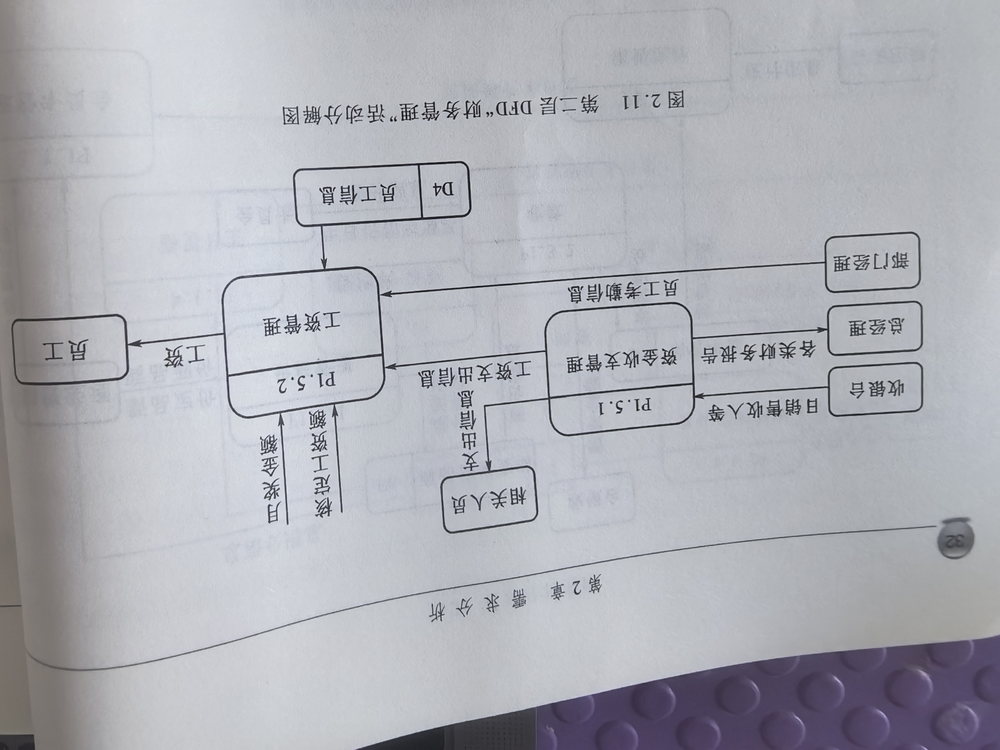

## 专业术语

| 中文 | 英文 | 简称 | 说明 |
| --- | --- | --- | --- |
| 数据流图 | Data Flow Diagram | DFD | 一种建模方法 |
|  | ICAM DEFinition Method | IDEF0 | 一种建模方法 |

## 2.1 需求分析

### 2.1.1 需求分析的概念与意义

需求：系统服务或约束的描述。
需求：软件项目的投资方和使用者对一个带开发的系统在实现目标、完成功能、应达到的性能、安全性、可靠性登诸方面指标的一个期望和要求的集合。

需求分析的目标：以使用者和开发人员都容易理解的文档形式提供一个关于目标系统所完成的全部功能及性能等需求的完整描述。以保证目标系统后续阶段，如系统设计、编码、测试等阶段工作的顺利完成没最终开发出一个满意度高的系统打下基础。

软件产品的特性：

1. 软件功能复杂；
2. 需求的可变性；
3. 软件产品的不可见性；

需求分析的结果通常以模型形式展示，如用DFD图、IDEF0图等建模工具和方法描述系统的信息流、功能结构及完成各功能需要的数据。

需求分析的产出：
**功能模型**：描述系统功能的模型。
**软件需求规格说明书**：对待开发系统的目标、功能、约束、开发技术和数据库管理系统的选型等全面详尽的说明书。

软件开发的依据：功能模型 + 软件需求规格说明书

### 2.1.2 需求获取的方法

方法：

1. 面谈：面谈是获取需求的最基本的方法；
2. 实地观察：
3. 问卷调查：
4. 查阅资料：

### 2.1.3 需求分析过程

**1、标识问题**

通过对问题的识别和标识获得对所求解问题及其运行环境的理解。

在软件开发周期中一个错误发现得越晚，修复错误的费用和代价就越高。

在标识理解需求的同时，还要注意确定系统的人机界面。

**2、建立需求模型**

模型：是对现实原型所作的一种抽象。
建立需求模型的方法：DFD图、IDEF0图。

**3、描述需求**

需求描述包括：对应用信息系统或软件项目**功能性需求**和**非功能性需求**的描述。

功能性需求：需要计算机系统实际解决的问题或实现的具体功能，即常说的数据处理要求，侧重描述系统在一定条件下的活动。
非功能性需求：信息系统或软件项目对实际运行环境的要求。

需求描述：对待开发系统葱宏观和整体上的一个完整描述。

需求描述 = 需求模型（系统功能模型）+ 软件需求说明书

重点叙述和说明一下内容：

1. 需求概述：概要描述软件项目的研发背景及意义，包括现行系统的运行、管理及经营的方式、特点及状况、存在的问题和亟待解决的问题；本项目的指导思想及研究目标，包括总目标、阶段目标及长期目标。
2. 功能需求：详细描述系统的总体结构及功能。
3. 信息需求：完整描述系统涉及的信息范围、数据的熟悉感特征、数据之间的关系及约束。
4. 性能需求：对系统的性能要求。包括响应时间、存储容量、系统的适应性、数据的安全性、一致性和可靠性等。
5. 环境要求：对系统运行环境的要求。如操作系统、数据库管理系统、开发工具、通信接口等
6. 其他需求：对目标系统检测或验收方面的要求。包括目标系统的可用性、可操作性、可维护性、可移植性等。

分析要思考的问题：
...

需求文档是需求分析工作完成的标志。
力求做到论述全面、结构清晰、内容准确、描述清楚。

**4、确认需求**

需求确认或评审的目的：进一步检查确信需求说明书中不包含任何不一致和含糊的内容，进一步正式需求说明书描述的内容是客户所期望和需要的。

审核内容：

1. **功能需求**：审查DFD图或IDEF0图或其他需求模型所描述内容是否与需求说明书中说明的相关内容一致。
2. **数据需求**：设差数据需求。包括目标系统覆盖的信息范围、存储和管理的数据、数据之间的关系及约束是否满足需求。
3. **性能**：审查系统的性能是否满足需求。通过对数据的检索时间、加工处理和数据转换、传送时间、更新操作等时间特性的考察。
4. **数据管理**：审查需求分析及相关描述是否合理，是否满足数据存储和管理的要求。根据系统存储和管理的关系表、记录规模和可预见的增长量。
5. **其他需求**：如安全性、可维护性、可扩充性，以及运行环境等方面的分析、设想及软硬件方面的选型是否合理且满足需求。

## 2.2 需求分析方法

### 2.2.1 需求分析方法的概述

结构化分析方法的基本特征是抽象和分解。

结构化分析及建模方法的主要优点：

1. 不过早陷入具体的细节；
2. 从整体或宏观入手分析问题，如业务系统的总体结构、系统及子系统的关系；
3. 通过图形化的模型对象只管地标识系统要做什么，完成什么功能；
4. 图形化建模方法方便系统分析员理解和描述系统；
5. 模型对象不涉及太多技术术语，便于用户理解模型。

### 2.2.2 DFD需求建模方法

DFD建模方法，又称过程建模和功能建模方法。
DFD建模方法的核心是**数据流**，从应用系统的数据流着手以图形化方式刻画和标识一个具体业务系统中的数据处理过程和数据流。

**1、DFD方法的基本元素**

1. 数据流（Data Flow）：用箭头描述数据的流向，箭头上标注的内容可以是信息说明或数据项；
2. 处理（Process）：用矩形框表示。表示对数据进行的加工和变化。指向处理的数据流为输入数据，离开的为输出数据。
3. 数据存储：表示用数据库形式存储的数据，对其进行的存取分别以指向或离开的箭头表示；
4. 外部项（也称数据源或数据终点）：描述系统数据的提供者（数据源）或数据的使用者（数据终点）；

 
**2、DFD图**

DFD图采用**自顶向下逐步细化的结构化分析方法**表示目标系统。

**3、DFD建模过程**

建立DFD图的目的：描述系统的功能需求。

过程：

1. 明确目标，确定系统范围。
2. 建立顶层DFD图。
3. 构建第一层DFD分解图。
4. 开发DFD层次结构图。
    1. 分解原则一：保持均匀的模型深度；
    2. 分解原则二：按困难程度进行选择；
        1. 从其中最不熟悉及最不清楚的处理开始分解；
        2. 选择某一处处理框分解，该处理框的分解将产生更多的关于其他处理框的信息。
    3. 如果一个处理难以确切命名，可以考虑对他重新进行分解。
5. 检查确认DFD图。
    1. 父图中描述过的数据流必须要在相应的子图中出现；
    2. 一个处理至少有一个输入流和一个输出流；
    3. 一个存储必定有流入的数据流和流出的数据流；
    4. 一个数据流至少有一端是处理框；
    5. 模型图中表达和描述的信息是全面、完整的、正确的和一致的。

层次结构图中的上一层是下一层的抽象，下一层是上一层的求精和细化，而最后一层中的每个处理都是具体的面向一个具体实现的描述，及一个处理模块仅描述和解决一个问题。

### 2.2.3 其他需求建模方法

**1、IDEF**
IDEF0：描述系统工嗯呢及相互关系；
IDEF1：描述系统信息及其数据之间的联系；
IDEF2：用于系统模拟，建立动态模型；
IDEF3：过程描述及获取方法；
IDEF4：面向对象设计方法；
IDEF5：本体论获取方法；
IDEF6：设计原理获取方法；
IDEF7：信息系统设定方法；
IDEF8：用户接口建模方法。

IDEF0图的基本元素：矩形框和箭头。

1. 矩形框：表示功能活动
    1. 活动名称：动词短语；写在矩形框内；
    2. 活动编号：矩形框右下角制定位置；
2. 箭头；表示左/右箭头（数据流），控制箭头（事件或者约束条件），机制箭头（物理手段或者资源）
    1. 左边进入箭头：表示完成活动需要的数据（输入的数据）；
    2. 右边输出箭头：表示活动产生的结果及信息（输出数据）；
    3. 上方进入箭头：表示描述了影响这个活动执行的事件或约束条件；
    4. 下方进入箭头：表示实施该活动的物理手段或完成活动需要的资源。

**输入**强调被活动消耗或编号的内容；
**控制**强调对活动的约束条件。
每个箭头所表示的数据用一个**名词短语描述**，数据可以是信息或对象

**2、UML用例模型简介**

UML：统一建模语言
UML方法采用面向对象思想建模，其中的「用例模型」用于描述系统功能需求

### 2.2.4 DFD和IDEF0比较

相同点：

1. 基础都是结构化分析思想；
2. 强调用自顶向下逐步求精的方法对现实时间建模；
3. 先抓住主要的问题或方面，形成较高层次的抽象，然后再由粗到细，由表及里地逐步细化，逐步涉及问题的具体细节。

差别：

1. DFD图用箭头表示数据流来描述数据移动方向、数据处理及处理之间的数据依赖。IDEF0图也用箭头表示数据流，但不是强调流或顺序，而是强调数据约束；
2. IDEF0图中的箭头有更加丰富的寓意；
3. 模型组成元素不同。

### 2.3 需求分析实例

