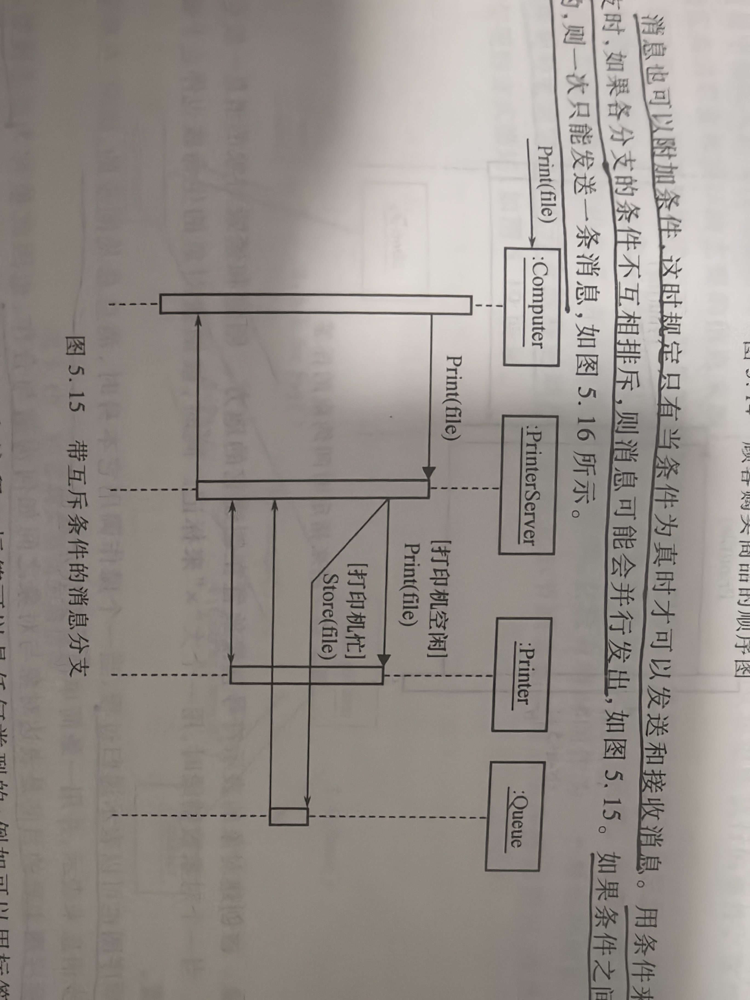
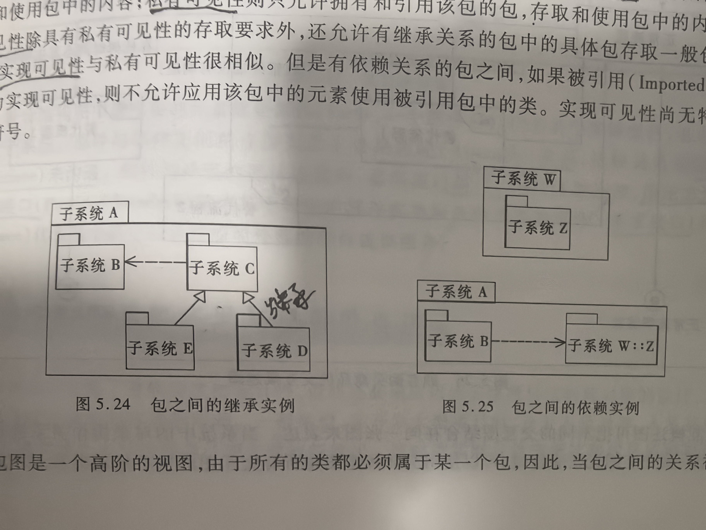
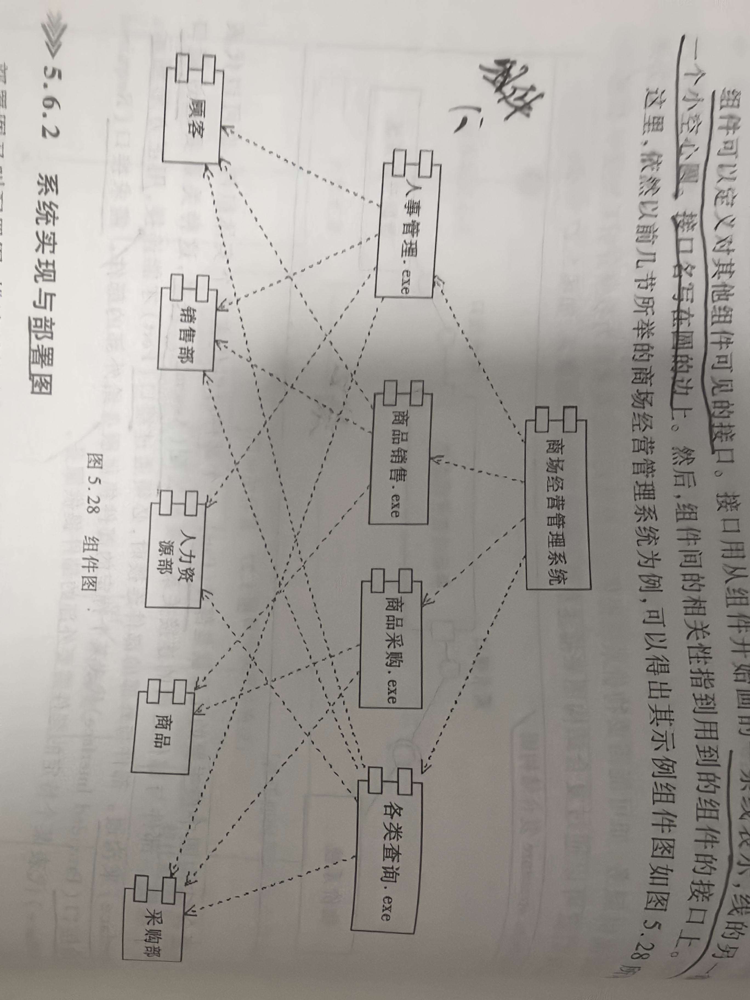

# 5 UML与数据库应用系统

## 专业术语

| 中文 | 英文 | 简称 | 说明 |
| --- | --- | --- | --- |
|  |  |  |  |

## 5.1 DBAS 建模

建模语言有：Booch、OOSE、OMT
Booch方法：
是最早面向对象的建模语言，Booch比较适合于系统的设计和构造。

OMT方法：
采用了面向对象的概念，并引入了各种独立于语言的表示符。
OMT特别适用于分析和描述已数据为中心的信息系统。

OOSE：
面向用例，并在用例的描述总引入了外部角色的概念。
OOSE比较适合支持商业工程和需求分析。

统一建模语言（Unified Modeling Language，UML）：
一种定义良好，易于表达、功能强大、通用的可视化建模语言
UML的定义由语义和表示法两部分组成、
语义：用自然语言描述
表示法：定义了UML的可视化标准表示符号

UML的语义是定义在一个四层（或四个抽象级）建模框架中的：
1. 元元模型（Meta-Meta Model）层，组成了UML最基本的元素 “事物（Thing）”。代表要定义的所有事物；
2. 元模型（Meta Model）层，组成了UML的基本元素，这一层的每个概念都是元元模型中“事物”概念的实例；
3. 模型（Model）层，组成了UML的模型，这一层的每个概念都是元模型层中概念的一个实例，这一层的模型通常叫「类模型（Class Model）」或「类型模型（Type Model）」；
4. 用户蘑菇型（User Model）层，这一层的所有元素都是UML模型的实例。这一层的模型通常被叫做「对象模型（Object Model）」或「示例模型（Instance Model）」

「视图」是对系统的模型在某方面的投影，注重与系统的某个方面。
UML包括如下五种视图：
1. 结构视图
2. 实现视图
3. 行为视图
4. 环境视图
5. 用例视图

每一种UML的视图都是由一个或多个图组成的，一个图就是系统架构的某个侧面的展示，所有的图一起组成了系统的完整视图

UML2.0提供了13中不同的图，分两大类
1. 结构图：主要用户对系统的静态结构建模，包括：类图、对象图、复合结构图、包图、组件图、部署图；
2. 行为图：主要用户对系统的动态行为建模，包括：用例图、交互图（顺序图、通信图、交互概述图、时间图）、状态图和活动图

## 5.2 DBAS 业务流程与需求表达

支持业务流程图的主要图形为「活动图（Activity Diagram）」。
活动图的主要目的：在于陈述活动与活动之间的流程控制的转移

### 5.2.1 业务流程与活动图

活动图主要用于描述系统、用例和程序模块中逻辑流程的先后执行次序，并行次序。
活动图用于描述系统功能时，侧重于系统多个用例活动之间相互制约的执行顺序。
活动图用于描述用例时，用于描述用例中的操作执行次序和操作完成的结果。


解读：
1. 起始点：必须且只有一个起始点，用圆心黑点表示；
2. 结束点：可以有多个结束点，用圆环包括圆心黑点表示；
3. 分区：利用分区来将活动分配给对应的角色。
4. 活动转换：箭头表示，箭头表示执行方向，标注为执行下一个活动的条件。「加粗直线」表示同步条，表示可并行进行。「菱形」代表分支，表示判断。

活动图的目的：表达流程的规范性，表达要明确、简单和清晰，尽量避免深入细节。

### 5.2.2 系统需求与用例图

用例模型：把满足用户需求的所有功能表示出来的工具。

用力模型组成：
1. 用例：描述从系统用户的角度观察，系统应该具有哪些功能，帮助分析人员理解系统的行为；
2. 角色：与系统进行交互的外部实体。可以说系统用户，也可以是其他系统或者硬件设备。
3. 系统：在边界线以内的区域抽象地表示能够实现的所有基本功能。

用例模型由「用例图」构成，用例图由系统、角色和用例三种模型元素以及元素之间的各种关系组成
1. 系统：长方框表示，系统名字写在「方框上」或「方框内」。方框内部还可以包含该系统中用符号表示的用例。
2. 角色：角色是类，所以它拥有与类相同的关系描述。用「通用化关系」来描述角色之间的行为。
    > 通用化关系：把某些角色的共同行为抽取出来作为通用行为，这些通用行为构成他们的「超类」。通用化关系用「带空心三角形」（作为箭头）的直线表示，箭头的方向指向超类
3. 用例：代表一个完整的功能，是所有「动作集合」。
    > 动作（Action）：是系统的一次操作。在系统内进行的工作都可以称作「动作」。
    > 表示符号：椭圆形


用例与角色之间有连接关系，此关系属于「关联（Association）」，又称作「通信关联（Communication Association）」

用例之间也存在关系，包括「扩展、使用、组合」三种。
扩展和使用是继承关系，即通用化关系的另一种体现形式。
组合则是把相关的用例打成包，当做一个整体看待。

1. 扩展关系：用例之间的扩展关系可以图示为：带有构造型`(sterotype)<<extend>>`标志通用化关系
2. 使用关系：用例之间的使用关系可以图示为：带有构造型`<<uses>>`标志的通用化关系


## 5.3 DBAS 系统内部结构的表达                      

系统内部结构分为：静态结构、动态结构
静态结构：用类图描述
动态结构：用顺序图和通信图描述

### 5.3.1 系统结构与类图

类图：表单的是问题领域的概念模型，抽象概念的名称、属性和行为。

**1、属性：**
UML语法
```uml
可见性 名称: 类型=缺省值 {约束性}
```
1. 可见性：共有（public）（+表示）、受保护（Protected）（#表示）、私有（Private）（-表示）
2. 名称：字符串
3. 类型：可以是基本数据类型，也可以是用户自定义类型
4. 缺省值：属性的初始值；
5. 约束性：列出该属性所有可能得取值

**1、操作：**
UML语法：
```uml
可见性 名称(参数表): 返回类型表达式 {约束性}
```
1. 可见性：同上
2. 名称：同上
3. 参数表：参数个数任意
4. 返回类型表达式：可选项，语言的描述
5. 约束性：同上

**3、关系**

类与类之间关系：关联、通用化（继承）、依赖、精化

1. 关联关系：
    > 导航关联：类与类之间的关联是单向的
    > 角色多重性：表示参与对象的数目的上下界限。*表示0-正无穷，1表示1..1的缩写

关联类：通过一个虚线与关联连接


聚集：特殊形式的关联

聚集分为：共享聚集、组成

共享聚集：空心菱形表示
组成：实心菱形表示


2. 继承关系
表示方法：一头为空心三角形的连接线
前者为：一般元素、基类元素或父元素；
后者为：特殊元素或子元素
继承定义了一般元素和特色元素之间的分类关系

3. 依赖关系
x，y元素，修改x元素的定义可能会引起y元素的定义的修改，那么y依赖于x

4. 精化关系
表示方法：带空心三践行的虚线表示
表示同一事物的两种描述之间的关系


### 5.3.2 系统结构与顺序图

顺序图的目的：说明对象的协作如何达到系统的目标
顺序图主要用于描述系统内对象之间的「消息发送」和「接受序列」
纵向表示：时间的持续过程；
横向表示：对象
对象用「矩形框」表示，纵向的虚线表示对象在序列中的执行情况，称为对象的生命线
对象件的通信用对生命线之间的「水平消息现」表示，消息/方法名称标注在消息线上面。

浏览顺序图方法：从上到下查看对象间交换的信息


消息也可以附加条件，这时规定只有当条件为真时才可以发送和接受消息。
用条件来描述分支时，如果个分支的条件不相互排斥，则消息可能会并行发出。
如果条件之间是互斥的，则一次只能发送一条信息



对象图的左边和右边可以有标签和注释
标签：可以是任何类型的
注释：循环过程就可以用边缘注释来描述

顺序图中可以描述对象是如何被创建和销毁的


顺序图也可以表示递归过程，当一个操作调用它本身，消息总是同步的。
顺序图主要的目的是表达对象与对象之间是如何沟通与合作的，因此被称为「动态模型」


### 5.3.3 系统结构与通信图

「通信图」是交互图的一种，也被称为「协作图」

通信图中包含一组对像，并在途中展示这些对象之间的联系以及对象间发送和接受的消息

顺序图和通信图都描述交互
顺序图强调时间，通信图强调空间

序列号来确定消息及并发线程的顺序


## 5.4 DBAS 系统微观设计的表达

UML细节方面的内容用图：对象图、状态图、时间图

### 5.4.1 微观设计与对象图

对象图是根据类图所诞生的实例，对象图是类图的一个实例，对象之间的的关系是类之间的关系的实例


### 5.4.2 微观设计与状态机图

当某一个对象或某一个事件有非常复杂的「状态转换」时，可用状态机图来描述这个过程。
状态图的主要目的：陈述系统中有关事件或对象的状态转移。


### 5.4.3 微观设计与时间图

时间图中，「矩形框」就是一个生命线；
矩形框的最下面为时间轴，时间轴上可以指定刻度单位；
在矩形框内高低起伏的线代表时间的进行以及状态的转移，称为「时间线」
状态的转移主要是以时间来驱动的，时间以纯文字来表达


## 5.5 DBAS 系统宏观设计的表达

微观设计：指的是设计的焦点放在单一对象或事件上
宏观设计：指将设计的焦点放在研究比较大范围中的元素之间的联系，如包、命名空间、子系统等

### 5.5.1 宏观设计与包图

命名空间之间能够「松耦合」，命名空间的类，则可以满足「高内聚」的要求。

UML的包图可以表达系统中不同的包、命名空间或不同的项目间彼此的关系。
在这里，包及命名空间值得是逻辑层次上的关联性，而项目则是指实体层次的关联性。

包：一种组合机制，把模型元素通过内在的语义连在一起称为一个整体。
包能够引用其他包的模型元素。
包与包之间允许建立的关系有「依赖、精化、通用化」

包的图示：


复合聚合：一个包是由模型元素构成的
共享聚合：一个包从其他的包中引用模型元素

包也具有可见性，利用可见性控制外部包队包中内容的存取方式。
包的可见性：私有、保护、共有和实现；
缺省的可见性为共有；



### 5.5.2 宏观设计与交互概述图

交互概述图：利用活动图作为基础，只是其在控制流间链接的UML元素并非活动，而是交互图（包括顺序图、通信图时间图、交互概述图）。因此，交互概述图的猪獒元数和活动图完全一样，唯一不同的是「交互框」


### 5.5.3 宏观设计与复合结构图

若要开发的系统是属于「主动式链接外部系统」，此时，外部系统的访问接口会成为要开发系统的限制；
相反，属于「被动式提供服务」的话，则要开发系统必须要定义出标准的访问接口，成为其他系统的限制条件

复合结构图适合用于需要进行系统整合的情况，可以利用复合结构图绘制出「要开发系统」与「外部系统」间的关系


图解：
1. 部件：代表实体组件或者表示子系统
2. 装配关系：部件与部件之间的连接关系，通过「接口」来沟通
3. 端口：部件和外部的部件连接方式，用正方形表示；
4. 供给接口：某个特定的部件提供服务给外部的部件
5. 需求接口：某个特定的部件需要外部的部件提供服务。

## 5.6 DBAS 系统实现与部署的表达

### 5.6.1 系统实现与组件图

组件图：表示系统的静态实现视图，展现了一组组件之间的组织和依赖，用于对源代码、可执行的发布、物理数据库等的系统建模。
组件是逻辑设计中定义的概念和功能在物理架构中的实现。

组件是开发环境中的实现文件。
表示符号：一个大方块且在它左边有两个凸出的小方块

组件间的相关性链接，用一条「带箭头的虚线」表示。
组件可以定义对其他组件可见的接口。接口用从组件开发画的「一条线」表示，线的另一端为一个「小空心圆」，接口名写在圆的边上。



### 5.6.2 系统实现与部署图

「部署图」又叫「配置图」，描述系统中硬件和软件的物理配置情况和系统体系结构


