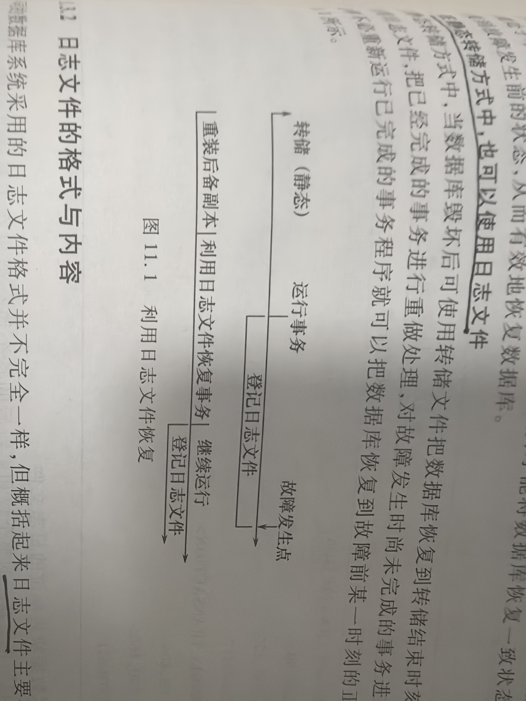
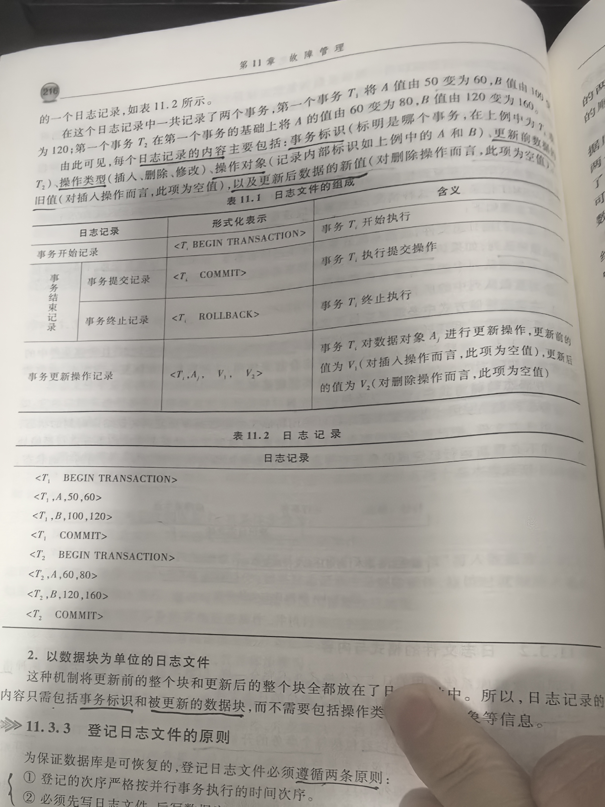
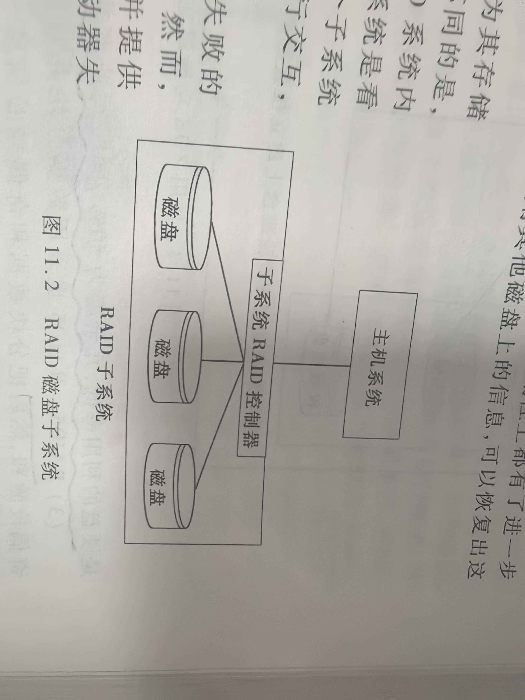
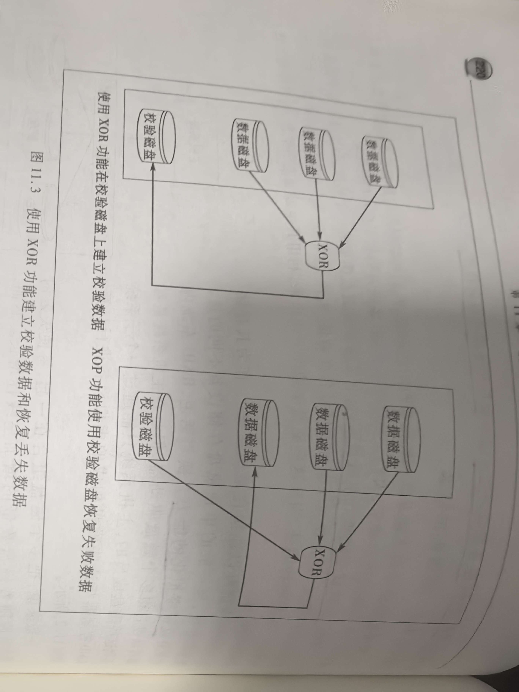
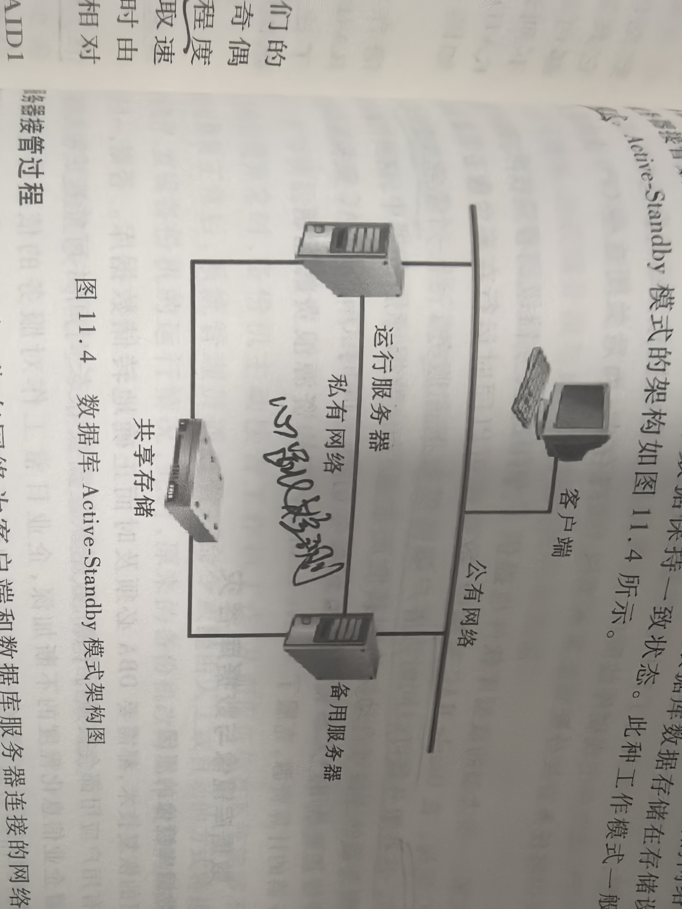
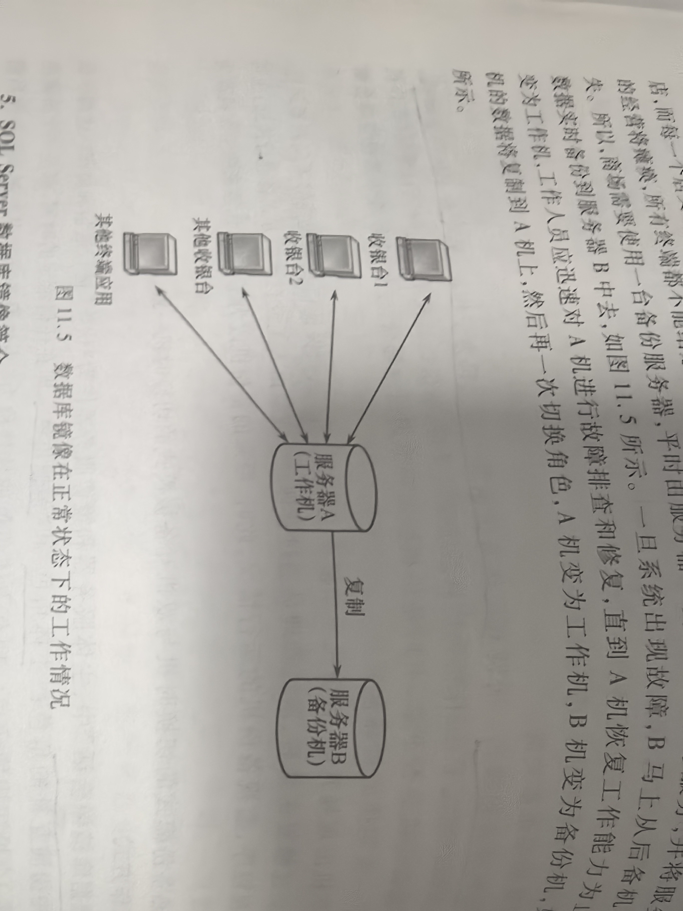
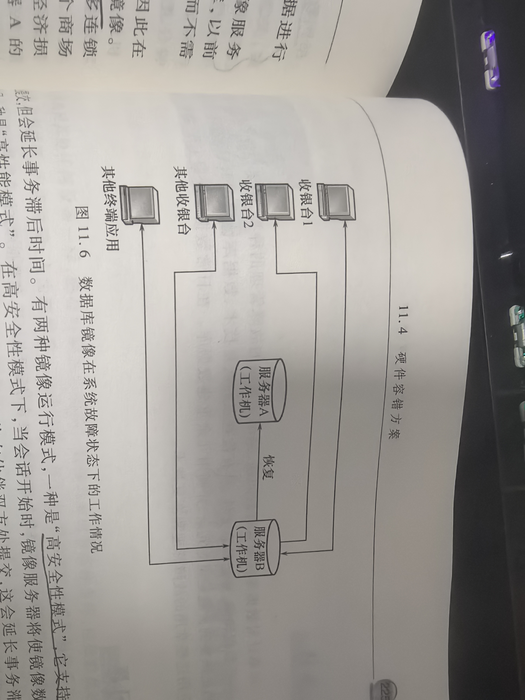

# 11 故障管理

## 专业术语

| 中文 | 英文 | 简称 | 说明 |
| --- | --- | --- | --- |
|  |  |  |  |

## 11.1 故障管理概述

### 11.1.1 故障类型及其解决方法

数据库系统重四类故障：事务内部的故障、系统故障、介质故障、计算机病毒故障

**1. 事务内部的故障**

分为预期事务内部故障和非预期事务内部故障，大部分为非预期故障
1. 预期事务内部故障：
    > 指可以通过事务程序本身发现的事务内部故障
    > 可以通过将事务回滚，撤销其对数据库的修改，从而使数据库回到一致性的状态
2. 非预期事务内部故障：
    > 非预期的事务内部故障是不能由事务程序处理的，如：运算溢出故障、并发事务死锁故障、违反了某些完整性限制而导致的故障等

恢复程序必须强行回滚事务，在保证该事务对其他事务没有影响的条件下，利用日志文件撤销其对数据库的修改，使数据库恢复到该事务运行之前的状态。
事务故障的恢复是由系统自动完成的，对用户是透明的。

**2. 系统故障**

又称：软故障。
指数据库在运行过程中，由于硬件故障、数据库软件及操作系统的漏洞、突然停电等情况，导致系统停止运转。
所有正在运行的事务以非正常方式终止，需要系统重启的一类故障。

系统故障将导致易失性存储器内容的丢失，而非易失性存储器内容依然完好。

当数据库发生系统故障时，容错对策是重启系统后，撤销（UNDO）所有未提交的事务，重做（REDO）所有已提交的事务，以达到容错目的

**3. 介质故障**

又称：硬故障
指数据库在运行过程中，由于磁头碰撞、磁盘损坏、强磁干扰、天灾人祸等情况，使得数据库中的数据部分或全部丢失的一类故障。

介质故障的容错对策两种方式：
1. 软件容错：使用数据库备份及事务日志文件，通过恢复技术，恢复数据库到备份结束时的状态。
2. 硬件容错：
    > 常用硬件容错 - 双物理存储设备。
    > 另一种方式 - 设计两套相同的数据库系统

**4. 计算机病毒故障**

这四种故障的本质都是对数据库本身的破坏或对数据库中数据的破坏。
恢复的基本原理：冗余

### 11.1.2 数据库恢复技术概述

恢复机制设计的两个关键问题：
1. 如何建立冗余数据
2. 如何利用这些冗余数据实施数据库恢复

常用的方法：数据备份和登录日志文件

## 11.2 数据转储

也称：数据备份
数据转储：指数据库管理员（DBA）或数据库管理系统定期复制数据库，并将复制得到的数据存放到其他介质中的过程

### 11.2.1 静态转储和动态转储

1. 静态转储：在静态转储过程中系统不能运行其他事务，不允许在转储期间对数据库有任何的存取、修改活动，即转储前后系统必须处于一个一致性的状态。
2. 动态转储：指允许转储操作和用户事务并发执行，即允许在转储过程中对数据库进行存取和修改操作。

静态转储虽然保证了数据的有效性，但是却是以降低数据库的可用性为代价的；
动态转储虽然提高了数据库的可用性，但数据的有效性却可能得不到保证。

完成解决静态转储和动态转出的优缺点问题：
> 引入日志文件，用它记录转储期间各事务对数据库的修改活动记录，然后使用动态转储的备份副本+日志文件就可以将数据库恢复到某一时刻的正确状态

### 11.2.2 数据转储机制

1. 完全转储：是对数据库中所有数据进行转储
2. 增量转储：只复制上一次转储后发生变化的文件或数据块
3. 差量转储（也称：差异转储）：是对最近一次数据库完全转储以来发生的数据变化进行转储

### 11.2.3 多种转储方法结合使用

1. 仅使用完全转储：移动数据量大、占用时间和空间较多、对数据库性能可能产生较大影响，代价较大
2. 完全转储 + 增量转储：
3. 完全转储 + 差量转储：

## 11.3 日志文件

### 11.3.1 日志文件的概念

日志文件记录每个事务对数据库的修改操作。

**1. 事务故障恢复和系统故障恢复必须使用日志文件**

1. 故障恢复的两个基本操作

1.1 UNDO(Ti): 撤销事务Ti

    1、方向扫描日志文件，找到需要撤销的事务的更新操作
    2、对事务Ti的更新操作执行逆操作，即将日志文件中“更新前的值”写入数据库。如果日志记录中有插入操作，撤销时就做删除操作；删除操作，撤销时就做插入操作；修改操作，撤销时就用修改前的值代替修改后的值
    3、继续反向查找该事务的其他更新操作，并执行相应的逆操作
    4、重复执行3步骤，直至遇到该事务的开始记录

1.2 REDO(Ti): 重做事务Ti

    1、正向扫描日志文件，找到需要重做的事务的更新操作
    2、对事务Ti重新执行日志文件登记的操作，即将日志文件中“更新后的值”写入数据库
    3、继续正向查找该事务的其他更新操作，并重新执行，将日志文件中“更新后的值”写入数据库
    4、重复执行3步骤，直至遇到该事务的提交记录

2. 事务故障恢复

事务故障恢复时，只需把相应的事务作撤销操作即可。

3. 系统鼓鼓掌恢复

3.1、情况一：事务已经开始但是还没有提交
    > 作撤销
3.2、情况二：事务已经完成了事务的所有操作并提交，但其对数据库的修改还保留在缓冲区
    > 作重做

具体步骤：
1. 正向扫描日志文件，找打系统故障前发生的所有失去，如果该「事务没有完成」，将其事务标记加入「撤销队列」；如果该「事务已经完成」，则将其事务标记加入「重做队列」；
2. 对撤销队列中的所有事务作撤销操作；
3. 对重做队列中的所有事务作重做操作。

**2. 在动态转储方式中必须建立日志文件**

**3. 在静态转储方式中，也可以使用日志文件**

### 11.3.2 日志文件的格式与内容

日志文件两种格式：
1. 以记录为单位的日志文件
2. 以数据块为单位的日志文件

**1. 以记录为单位的日志文件**

以记录为单位的日志文件内容包括每个事务的开始标记（BEGIN TRANSACTION）、每个事务的结束标记（包括事务提交记录或事务终止记录），以及每个事务的所有修改操作（位于开始标记和结束标记之间）

每个日志记录的内容主要包括：
1. 事务标识：标明是哪个事务
2. 操作类型：插入、删除、修改
3. 操作对象：记录内部标识
4. 更新前数据的旧值：插入，此项为空值
5. 更新后的数据新值：删除，此项为空值

**2. 以数据块为单位的日志文件**

内容包括
1. 事务标识
2. 被更新的数据块

### 11.3.3 登记日志文件的原则

遵循的原则：
1. 登记的次序严格按并行事务执行的时间次序：保证了事务对数据库操作的可再现性和正确性
2. 必须先写日志文件，后写数据库：

### 11.3.4 检查点

**1. 检查点的作用**

检查点对打限度地减少了数据库完全恢复时所执行的日志部分

**2. 检查点的引入**

思想：在日志文件中增加一类新的记录 -- 检查点记录

检查点记录的内容：
1. 建立检查点时刻所有正在执行的事务清单
2. 这些事务最近一个日志记录的地址

动态维护日志文件的方法是周期性地执行如下操作：建立检查点、保存数据库状态
具体步骤：
1. 将当前日志缓冲的所有日志记录写入磁盘的日志文件上；
2. 在日志文件中写入一个检查点记录
3. 将当前数据换从的所有数据库路写入磁盘的数据库中
4. 把检查点记录在日志文件中的地址写入一个“重新开始文件”

使用检查点方法可以改善恢复效率

恢复策略：
1. 如果事务在故障发生时未完成，应该予以撤销；
2. 如果事务在检查点之后提交，他们对数据库所做的修改在故障发生时可能还在缓冲区中，尚未写入数据库，应该予以重做；
3. 如果事务在检查点之前已经提交，所以不必执行重做操作

**3. 基于检查点的恢复步骤**

1. 从“重新开始文件”中找到最后一个检查点记录在日志文件中的地址，由改地址在日志文件中找到最后一个检查点记录
2. 由改检查点记录得到检查点建立时刻所有正在执行的事务清单 ACTIVE-LIST
    这里要建立两个事务队列
    1、UNDO-LIST: 需执行UNDO操作的事务集合 
    2、REDO-LIST: 需执行REDO操作的事务集合
    把ACTIVE-LIST暂时放入UNDO-LIST队列，REDO队列暂为空
3. 从检查点开始正向扫描日志文件
    1、如有新开始的事务Ti，把Ti暂时放入UNDO-LIST队列
    2、如有提交的事务Ti，把Ti从UNDO-LIST队列移到REDO-LIST队列
    直至日志文件结束
4. 对UNDO-LIST中每个事务执行UNDO操作，对REDO-LIST中的每个事务执行REDO操作

## 11.4 硬件容错方案

### 11.4.1 概述

容错方案：
1. 磁盘保护技术
2. 服务器容错技术
3. 数据库镜像与容错基础

### 11.4.2 磁盘保护技术

RAID: 廉价冗余磁盘阵列

RAID的冗余技术主要有：
1. 镜像冗余：把所有的数据复制到其他的设备上或其他地方
2. 校验冗余：通过对成员磁盘上的数据执行异或（XOR）操作，得到其校验值，并存放在另外的校验磁盘上

RAID级别：
1. RAID0：
    > 优点：采用数据分块、并行传送方式，能够提高读写速度
    > 缺点：存储空间没有冗余，对系统的可靠性没有任何提高，任一个硬盘介质出现故障时，数据将无法恢复
2. RAID1：
    > 优点：提高了读速度，加强了系统的可靠性
    > 缺点：硬盘的利用率低，冗余度为50%，同时写速度并没有提高
3. RAID5：
    > 优点：可以为系统提供数据安全保障
    > 缺点：保障程度要比RAID1低而磁盘空间利用率要比RAID1高
4. RAID10：
    > 优点：是RAID0和RAID1的组合体，继承了RAID0的快速和RAID1的安全。RAID10的冗余度50%，同时读写速度均提高
    > 缺点：

RAID从现实上一般可以分为「软RAID」和「硬RAID」
1. 软RAID：由操作系统或操作系统内专用的软件实现的RAID
2. 硬RAID：由专用的硬件设备实现的RAID

在数据库系统的服务器上，一般选择使用硬RAID
在数据库系统的数据存储中，一般建议采用RAID10，同时建议采用带有缓存的硬RAID

### 11.4.3 服务器容错技术

**1. 引入服务器容错原因**
**2. 服务器容错技术简介**

两台服务器共享存储设备
Active-Standby模式

**3. 服务器接管过程**

**4. 其他服务器容错技术简介**
1. Oracle数据库的RAC架构

### 11.4.4 数据库镜像与数据库容灾

**1. 引入数据库镜像的原因**

**2. 数据库镜像简介**

数据库镜像是一种用于提高数据库可用性的解决方案。它根据DBA的要求，自动把整个数据库或其中的关键数据复制到另一个磁盘上

数据库镜像优点：
1. 数据库镜像提供完整或接近完整的数据冗余，增强数据保护功能
2. 发生灾难时，数据库镜像可快速使数据库的备用副本提供服务，使数据不会丢失，提高数据库的可用性
3. 提高镜像数据库在升级期间的可用性

**3. 数据库镜像分类**

1. 双击互备援模式：两台主机均为工作机
2. 双击热备份模式：一台主机为工作机，另一台主机为备份机

**4. 工作方式**

在“数据库镜像会话”中，主体服务器和镜像服务器作为“伙伴”进行通信和协作。
这两个伙伴在会话中扮演互补角色：主体角色和镜像角色。
即在任何给定的时间，都是一个扮演主体角色，另一个扮演镜像角色

出现介质故障，使用“角色互换”来互换主体服务器和镜像服务器。

用户只选择关键数据和日志文件进行镜像，而不是对整个数据库进行镜像

**5. SQL server数据库镜像简介**

镜像的复制是一个备用的复制，不能直接访问，只用来进行错误恢复。

除了运行数据库和镜像数据库之外，还可以引入另一个可选组件 -- 见证服务器
它能使镜像服务器识别何时要启动自动故障转移，它判断什么时候进行错误恢复。

数据库镜像会话以同步操作或异步操作运行

镜像运行模式：
1. 高安全性模式
2. 高性能模式

所有数据库镜像会话都只支持一台主体服务器和一台镜像服务器

具有自动故障转移功能的高安全性模式要求使用第三个服务器示例，即见证服务器

数据库镜像提供三种实现方式：
1. 高可用性：两台服务器上同步事务写入，并支持自动错误恢复
2. 高保护：两台服务器上同步事务写入，但是错误恢复是手工的
3. 高性能：两个服务器上的写入可以不同步的，因此在性能上有所提高，只允许手工的错误恢复

