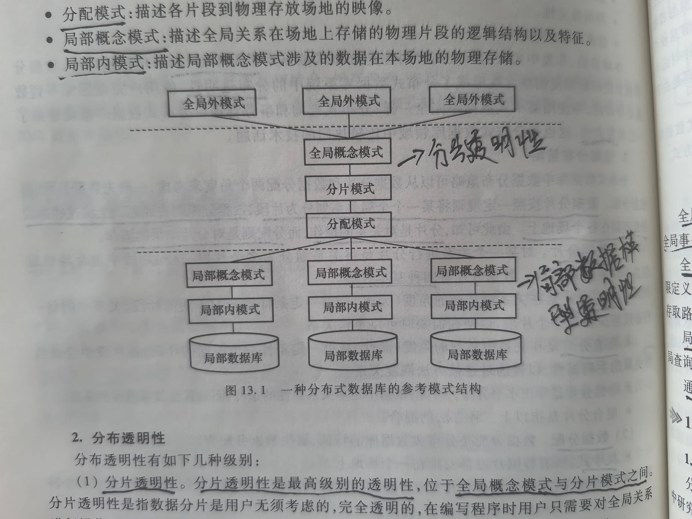
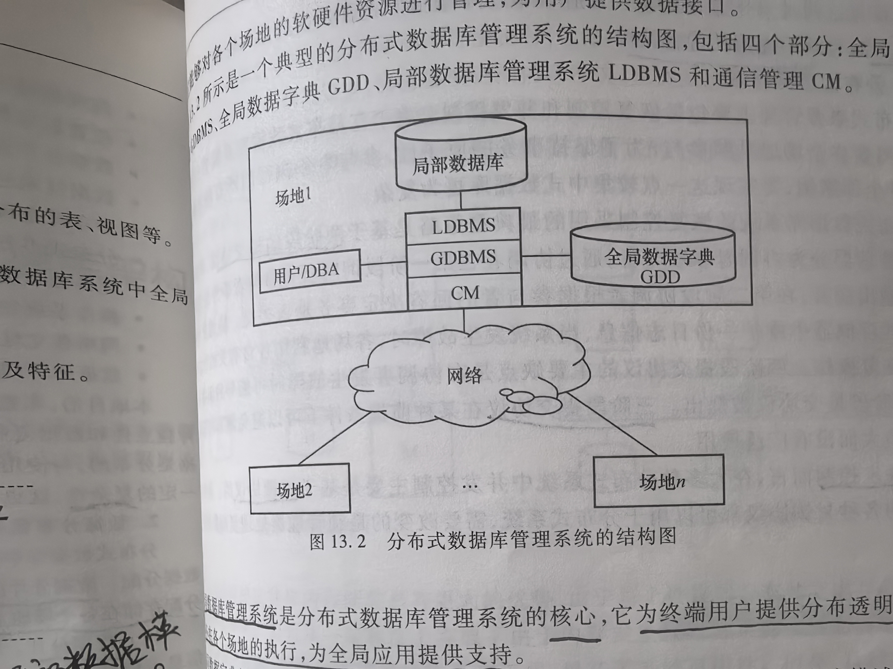
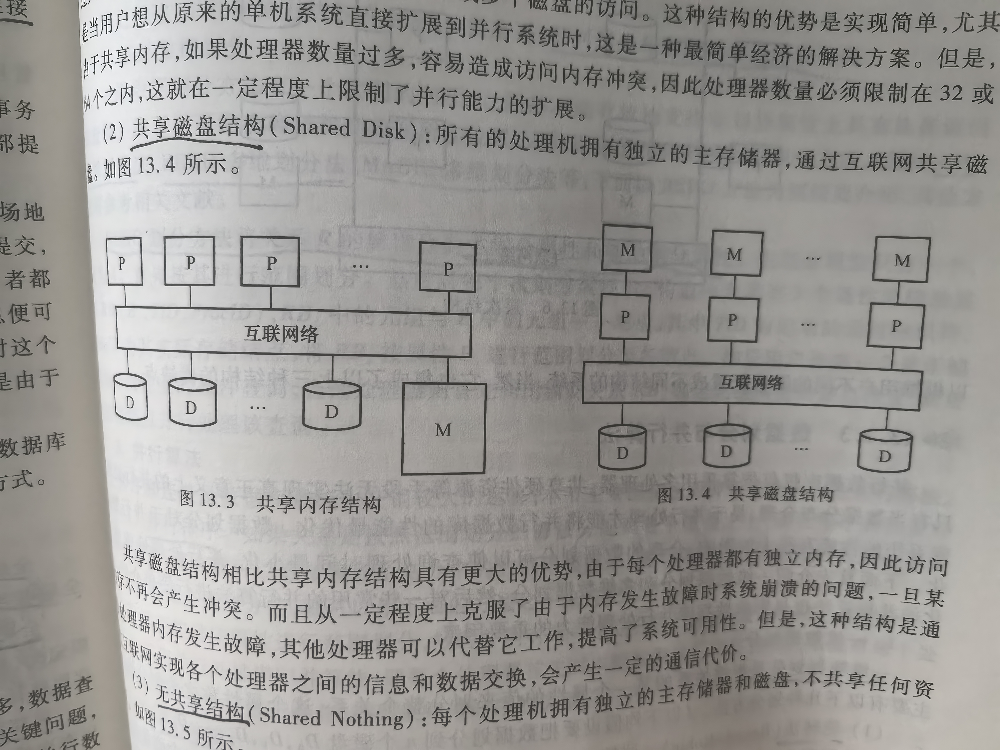
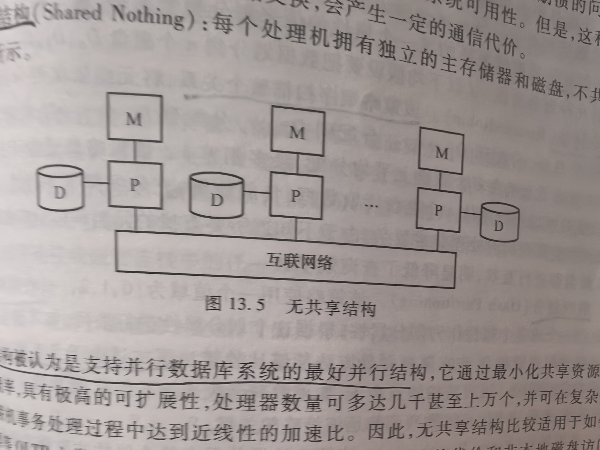
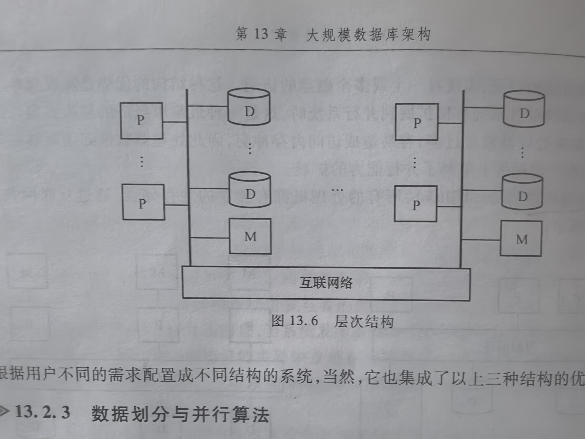
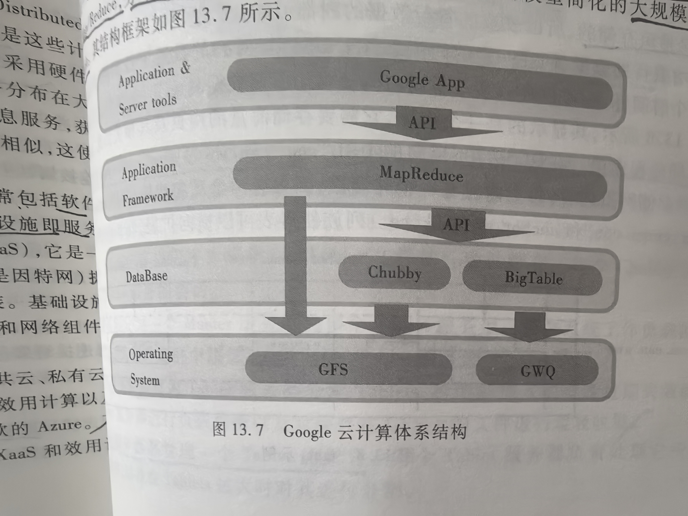
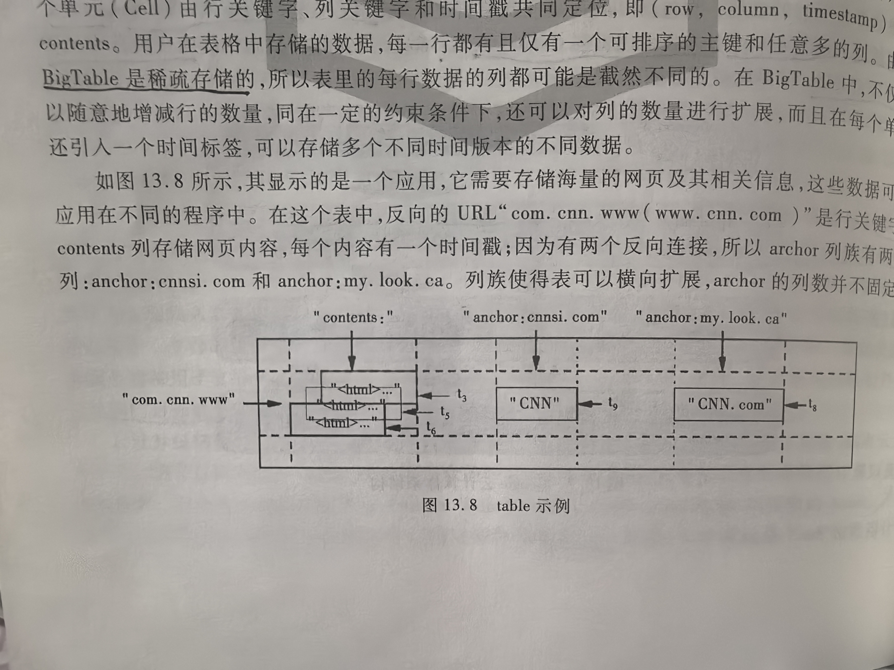
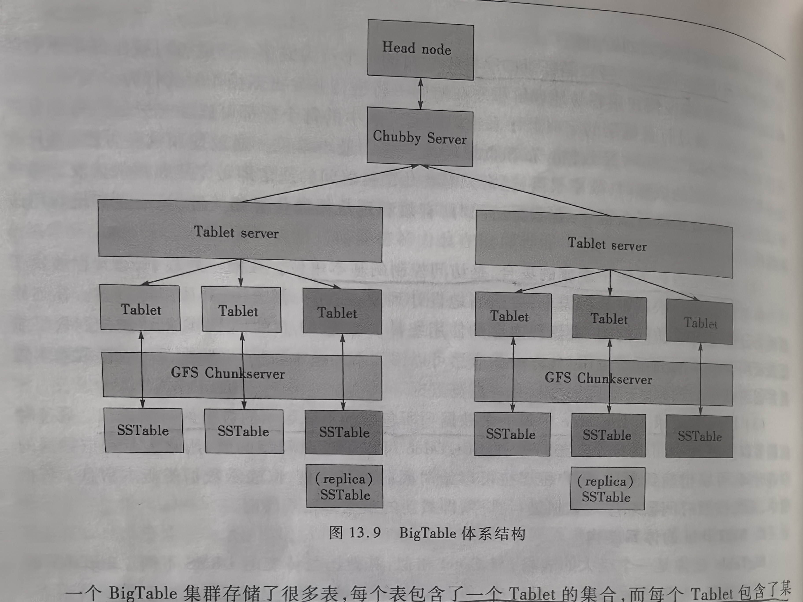
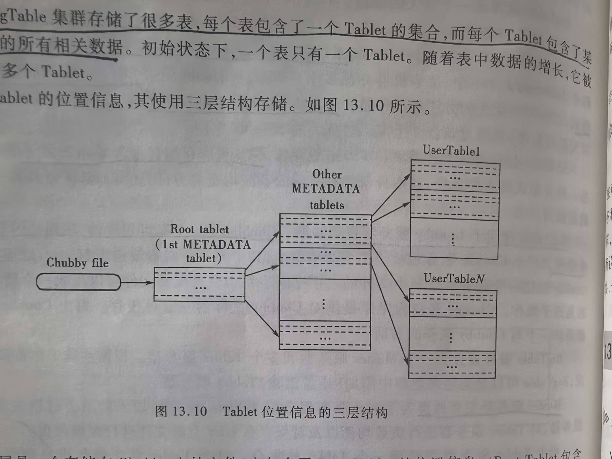

# 13 大规模数据库架构

## 专业术语

| 中文 | 英文 | 简称 | 说明 |
| --- | --- | --- | --- |
|  |  |  |  |

## 13.1 分布式数据库

### 13.1.1 分布式数据库系统概述

分布式数据库系统是物理上分散、逻辑上几种的数据库系统。
分布式数据库则是分布式数据库系统中各场地上数据库的逻辑集合

### 13.1.2 分布式数据库目标与数据分布策略

**1. 分布式数据库目标**

1. 本地自治
2. 非集中式管理
3. 高可用性
4. 位置独立性
5. 数据分片独立性
6. 数据复制独立性
7. 分布式查询处理
8. 分布式事务管理
9. 硬件独立性
10. 操作系统独立性
11. 网络独立性
12. 数据库管理系统独立性

基本特征：本地自治、非集中式管理、高可用性；
分布式透明性：位置独立性、数据分片独立性、数据复制独立性
分布式复杂性：分布式查询、事务管理

**2. 数据分布策略**

一般先数据分片，然后数据分配。
数据分片按照一定规则将某一个全局关系划分为片段；
数据分配则在此基础上将这些片段分配存储在各个场地上。

分片是对关系的操作，分配则是对分片结果的操作。

数据分片：
数据分片方法：
1. 水平分片
2. 垂直分片
3. 导出分片是导出水平分片，分片的依据不是本关系属性的条件，而是其他关系属性的条件
4. 混合分片：指以上三种方法的混合

数据分配：
数据分配方法：
1. 集中式
2. 分割式
3. 全复制式
4. 混合式

### 13.1.3 分布式数据库系统的体系结构

**1. 分布式数据库系统的参考模式结构**



1. 全局外模式：是全局应用的用户视图，即终端用户看到的逻辑上并未分布的表、视图等
2. 全局概念模式：描述全体数据的逻辑结构和特征
3. 分片模式：描述每个数据片段以及全局关系到片段的映像，是分布式数据库系统中全局数据的逻辑划分视图
4. 分配模式：描述个片段到物理存放场地的映像
5. 局部概念模式：描述全局关系在场地上存储的物理片段的逻辑结构以及特征
6. 局部内模式：描述局部概念模式设计的数据在本场地的物理存储

**2. 分布透明性**

分布透明性级别：
1. 分片透明性：最高级别的透明性，位于「全局概念模式」和「分片模式」之间
2. 位置透明性：
3. 局部数据模型透明性：位于「分配模式」和「局部概念模式」之间

**3. 分布式数据库管理系统**

分布式数据库管理系统是用于支持分布式数据库创建、运行、管理和维护的一种「数据库管理软件」



全局数据库管理系统是分布式数据库管理系统的核心，它为终端用户提供分布透明性，协调全局事务在各个场地的执行，为全局应用提供支持。
「全局数据字典」提供系统的各种描述、管理和控制信息。
「局部数据库管理系统」负责创建和管理局部数据库
通信管理负责在各个场地之间传送数据和消息

### 13.1.4 分布式数据库的相关技术

**1. 分布式查询**

分布式查询优化策略：
1. 操作执行的顺序；
2. 操作的执行算法（主要是连接操作和并操作）
3. 不同场地间数据流动顺序。

目前，针对链接操作广泛使用的优化策略：
1. 基于半连接的优化策略
2. 基于连接的优化策略

**2. 分布式事务管理**

分布式事务管理主要包括：恢复控制、并发控制

分布式数据库系统的恢复控制采用的最典型策略是「基于两阶段的提交协议」。
「三阶段提交协议」在某种前提条件下可以避免阻塞问题，但是由于其开销较大而没有广泛使用。

并发控制，主要「基于封锁协议」

## 13.2 并行数据库

### 13.2.1 并行数据库概述
### 13.2.2 并行数据库系统结构

并行数据库的体系结构有：
1. 共享内存结构
2. 共享磁盘结构
3. 无共享结构：被认为是支持并行数据库系统的最好并行结构
4. 层次结构





### 13.2.3 数据划分与并行算法

**1. 一维数据划分**

一维数据划分是根据关系的某一个属性的值来划分整个关系，这个属性称为「划分属性」。

划分方法：
1. 轮转发：该策略顺序扫描整个关系
2. 散列划分：更加适合点查询
3. 范围划分：

一般来讲，散列划分和范围划分使用更普遍

**2. 多维数据划分**

划分方法：
1. CMD多维划分法
2. BERD多维划分法
3. MAGIC多维划分法

BERD划分法将关系R的属性分为「主划分属性」和「辅助划分属性」。

**3. 并行算法**

并行算法：
1. 并行排序

（1）重新按排序属性进行范围划分，然后分别对每一个划分进行排序，最后将结果直接合并
（2）采用并行外排序归并算法，即每个处理器首先对本地数据进行排序，然后系统对每个处理器上已排序的数据进行合并，得到最终排好序的关系

2. 并行连接

（1）划分连接
（2）分片-复制连接

3. 其他的关系操作

（1）选择
（2）消除重复
（3）投影
（4）聚集

## 13.3 云计算数据库架构

### 13.3.1 云计算概述

云计算是分布式计算、并行计算和网格计算的发展。
云计算包括的：
1. 软件即服务（Software as a Service, SaaS）;
2. 平台即服务（Platform as a Service, PaaS）；
3. 基础设施即服务（Infrastructure as a Service, IaaS）

云计算的目标：通过网络提供越来越多的服务，实现一切即服务（XaaS）

云计算提供商的数据中心的软件硬件设施就是所谓的「云（Cloud）」。
云可以分为：
1. 公共云：当云以即用即付的方式提供给公众。典型的效用计算有：Amazon Web Services；Google AppEngine；微软的Azure；
2. 私有云：不对公众开放的企业或组织内部数据中心的资源
3. 混合云：

从硬件上看，云计算在三方面突破了传统：
1. 云计算能为应用系统提供似乎无限的计算资源，云计算终端用户无需再为计算力准备计划或预算
2. SaaS的服务供应商可以根据需要逐步追加硬件资源，而不需要预先给出许诺
3. 云计算具有为其用户提供短期使用资源的灵活性，当不再需要这些资源的时候，用户可以方便地释放这些资源

### 13.3.2 云数据库体系结构

云数据库（CloudDB），又称云库 = 云 + 数据库。

云计算平台：
1. Amazon的AWS（Amazon Web Services）；
2. Google的 GAE（Google AppEngine）
3. 开放的云计算平台 Hadoop

Google使用的云计算基础架构模式包括四个相互独立又紧密结合在一起的系统
1. 文件系统 Google File System；
2. 分布式编程环境 Map/Reduce；
3. 分布式的锁机制 Chubby；
4. 大规模分布式数据库 BigTable



**1. BigTable数据模型**

BigTable表的索引是「行关键字」、「列关键字」、「时间戳」，每个单元由行关键字、列关键字和时间戳共同定位，即（row, column, timestamp）cell contents.

BigTable是稀疏存储的。



1. 表中的「行关键字」可以是任意的字符串；
2. 列族是由「列关键字」组成的集合，是访问控制的基本单位；
3. 时间戳记录了BigTable中每一个数据项所包含的不同版本的数据的时间标识。

**2. BigTable 的体系结构**



BigTable的体系结构包含多个Table，每个Table是一个多维的稀疏表。
为了对巨大的Table实现高效的管理，系统将Table进行水平分片，分片后的表单元称为 Tablet 。
每个 Tablet 大小不定，每个机器存储多个Tablet。

BigTable 使用了 SSTable 作为底层存储数据的格式，它按照列优先的方式进行存储。SSTable是不可修改的。

SSTable由Google文件系统（GFS）组织存储，GFS负责存储日志文件和数据文件。

BigTable 使用了 Chubby 服务实现所功能。Chubby是一个高可用性的、序列化的分布式锁服务组件。

BigTable服务器分为一个「Master服务器」和多个「Tablet服务器」。根据系统工作负载的变化情况，BigTable可以动态地向集群中添加（或删除）Tablet服务器
Master服务器：主要负责为 Tablet服务器分配Tablets、检测新加入的或者过期失效的Tablet服务器、对Tablet服务器进行负载均衡以及对保存在GFS上的文件进行垃圾收集
Tablet服务器：每个Tablet服务器管理一个Tablet的集合。每个Tablet服务器负责处理它所加载的Tablet的读写操作，以及在Tablets过大时对齐进行分割。

一个BigTable集群存储了很多表，每个表包含了一个Tablet的集合，而每个Tablet包含了某个范围内行的所有相关数据




### 13.3.3 云数据库与传统数据库比较

云数据库的缺点:
1. 数据安全问题：
2. 对云的管理问题：
3. 对因特网的依赖

### 13.3.4 云数据库展望

正成为一种全球IT产业的潮流，即将进入蓬勃发展期。

## 13.4 XML数据库

### 13.4.1 XML数据库概述

XML（eXtensible  Markup Language）,可扩展标识语言。
用标签来描述数据。

XML一般用于标记电子文件，使其具有结构性，可以用来「标记数据、定义数据类型」，是一种允许用户对自己的标记语言进行定义的源语言。
XML被设计用来传送及携带数据信息，而不是用来表现或展示数据，HTML语言则用来展示数据。

XML数据库是一种支持对XML格式文档进行存储和查询等操作的数据库管理系统

XML数据库三种类型
1. XML Enabled Database（XEDB）：能处理XML的数据库；
2. Native XML Database（NXD）：纯XML数据库；
3. Hybrid XML Database（HXD）：混合XML数据库。

与传统数据库比较，XML数据库的优势：
1. XML数据库能够对半结构化数据进行有效的存取和管理。如网页内容就是一种半结构化数据；
2. 提供对标签和路径的操作。
3. 当数据本身具有层次特征时，由于XML数据格式能够清晰表达数据的层次特征，因此XML数据库便于对层次化数据进行操作。

### 13.4.2 SQL Server 2008与XML

**1. SQL Server中的XML语句**

示例：
1. 使用FOR XML RAW 参数，查询年龄在20-30岁之间的顾客姓名、性别、所在地址
```sql
SELECT CName,Sex,Addres FROM Table_Customer
    WHERE datediff(year, BirthDate, GetDate()) BETWEEN 20 AND 30 FOR XML RAW
```

FOR XML RAW: 采用查询结果并将结果集中的每一行转换为将通用标识符<row/>作为元数标记的XML元素。

2. 使用 FOR XML AUTO参数，查询年龄在20-30岁之间的顾客姓名、性别、所在地址
```sql
SELECT CName,Sex,Addres FROM Table_Customer
    WHERE datediff(year, BirthDate, GetDate()) BETWEEN 20 AND 30 FOR XML AUTO
```

FOR XML AUTO: 以简单的嵌套xml树返回查询结果

3. 使用 FOR XML AUTO参数，查询年龄在20-30岁之间的顾客姓名、性别、所在地址，同时输出XML的XSD
```sql
SELECT CName,Sex,Addres FROM Table_Customer
    WHERE datediff(year, BirthDate, GetDate()) BETWEEN 20 AND 30 FOR XML AUTO,XMLSCHEMA
```

XMLSCHEMA: 返回内内联W3C XML架构（XSD）；
XMLDATA: 指定应返回内联XML数据简化（XDR）架构；


**2. SQL Server中的XML数据类型**

示例：
1. 创建一个包含XML字段类型的表
```sql
CREATE TABLE 文档表
(
    文档编号 int,
    文档标题 nvarchar(50),
    文档内容 xml
)
```

2. 声明一个XML数据类型的变量
```sql
DECLARE @myXML xml
```

3. 将FOR XML的查询结果复制给XML变量并进行查询显示
```sql
SET @myXML = (SELECT 文档内容 FROM 文档表 WHERE 文档编号 = 1)
SELECT @myXML
```

XML实例通常较大，因此是作为二进制大型对象（BLOB）存储在数据库中的，
存储在XML类型列中的XML数据最大可以达到2GB，如果没有索引，在查询XML数据将会非常耗时。

XML索引与普通索引不同，分两种类型：
1. 主XML索引
2. 负责XML索引

数据行中存储了XML实例的结点信息，其中包括：
1. 元素名或属性名
2. 区别元素结点、属性结点、文本结点的结点类型
3. 结点的值
4. 由内部结点标示符标示的文档顺序信息
5. 从根结点到每个结点的路径
6. 其他信息

XML字段的第一个索引必须是主XML索引；
辅助XML所以可分为：PATH（路径）辅助XML索引、VALUE（值）辅助XML索引和PROPERTY(属性)负责XML索引
使用场景：
1. PATH（路径）辅助XML索引可提高搜索速度：XML字段中的实例经常进行指定路径的查询
2. VALUE（值）辅助XML索引可提高搜索速度：XML字段中的实例经常进行基于值的查询
3. PROPERTY(属性)负责XML索引可提高搜索速度：XML字段中的实例经常进行一个或多个属性值的查询

**3. 操作XML**

SQL Server 2008支持使用XQuery语言来查询XML数据类型。
1. Query方法：用于查询XML实例中XML结点；
2. Value方法：用于描述XML实例中获取结点或元数值；
3. Exist方法：用于判断查询是否返回空结果；
4. Modify方法：用于在XML实例中插入、修改和删除节点
