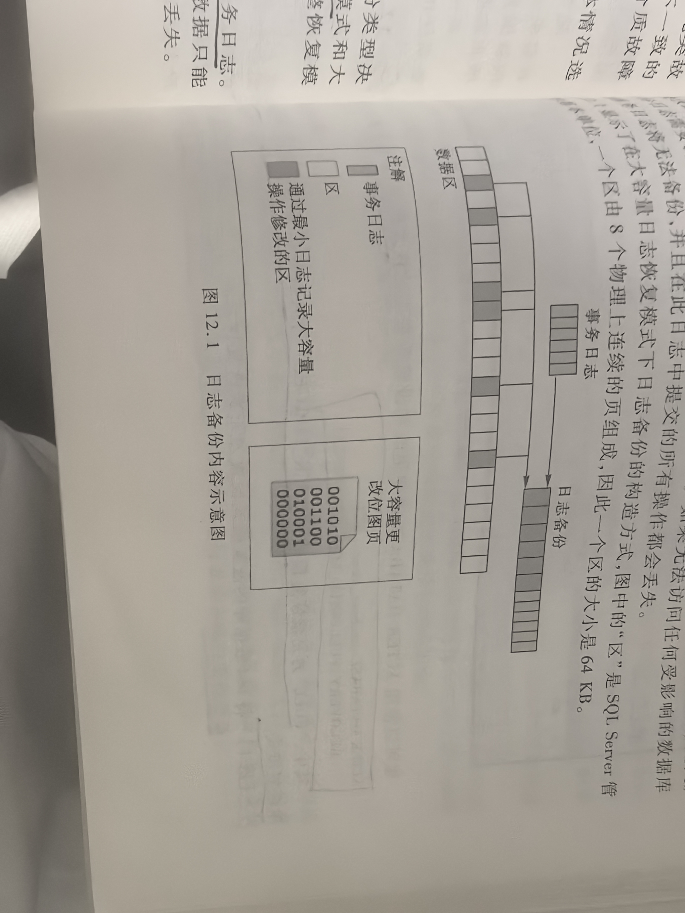
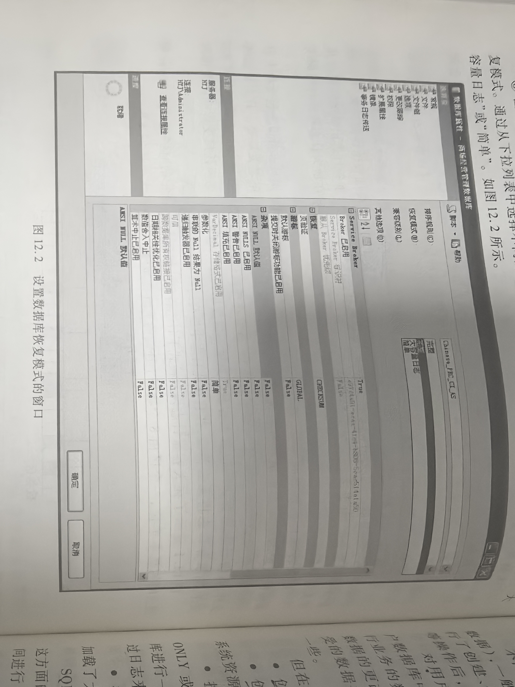
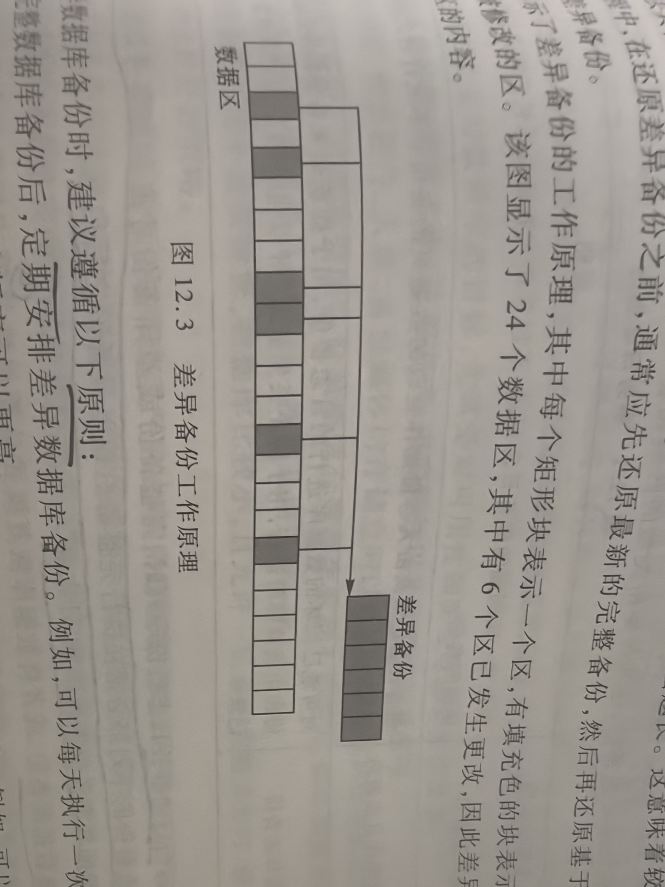
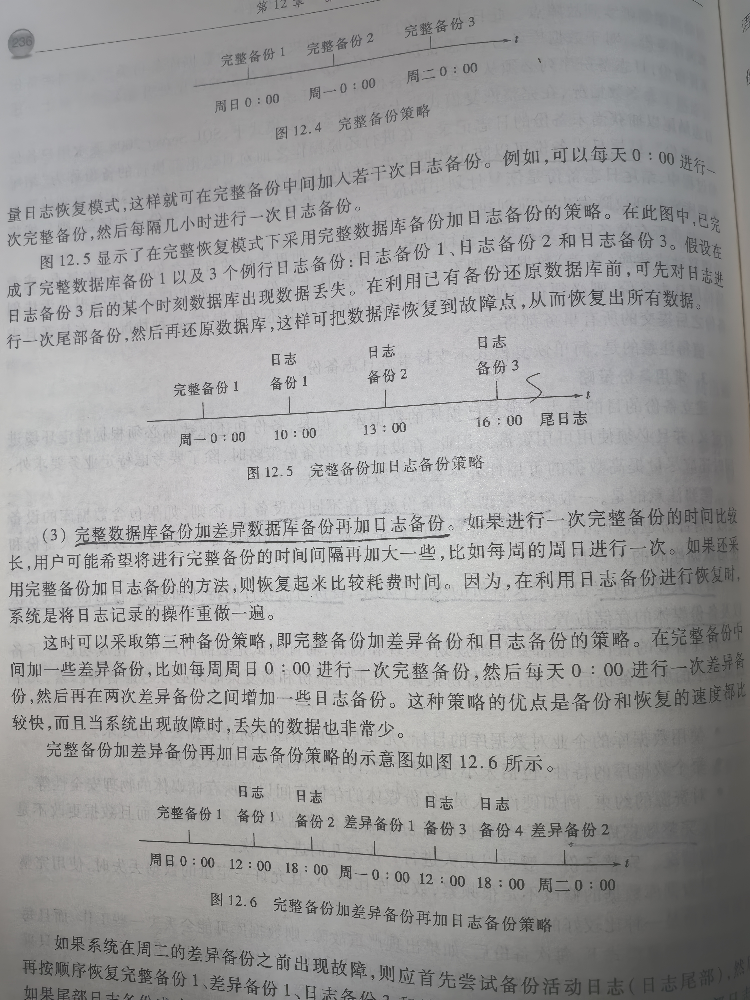
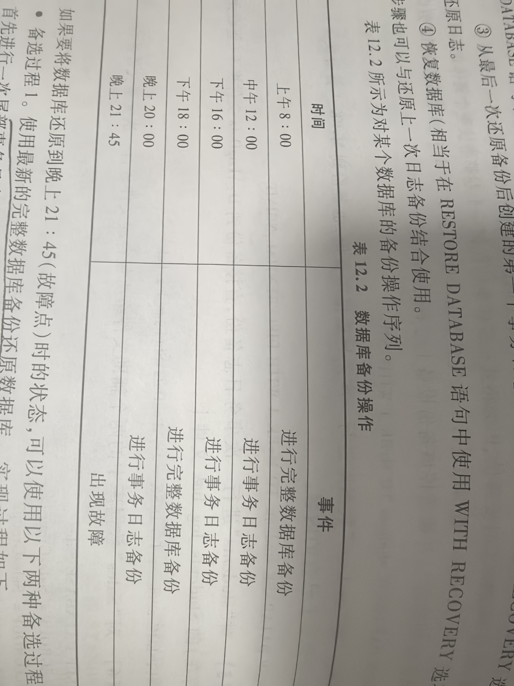
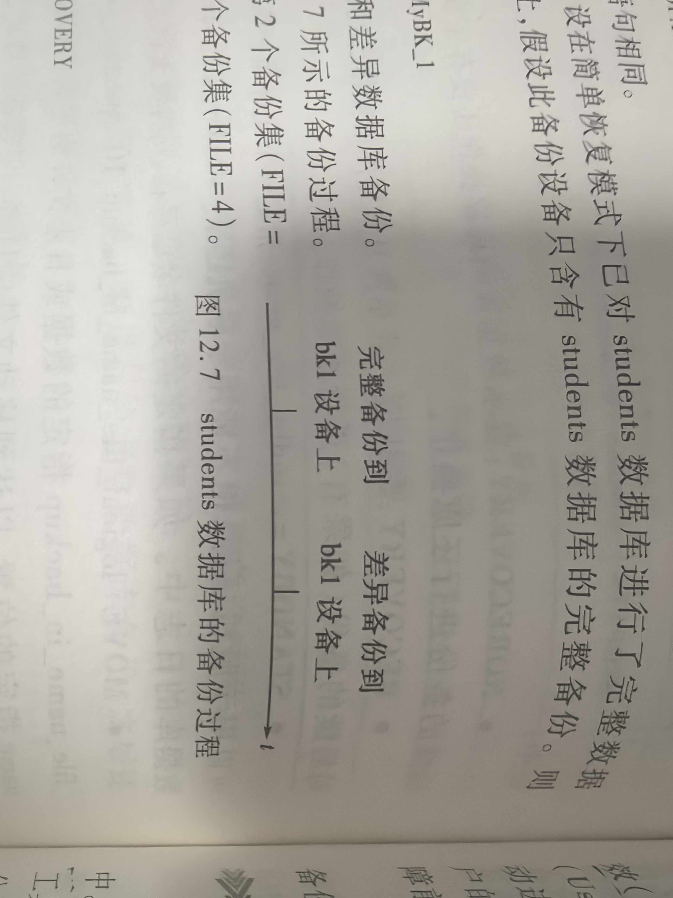

# 12 备份与恢复数据库

## 专业术语

| 中文 | 英文 | 简称 | 说明 |
| --- | --- | --- | --- |
|  |  |  |  |

## 12.1 备份与恢复的概念

### 12.1.1 备份数据库

备份是制作数据库的副本，包括数据库结构、对象和数据

造成数据丢失数据的原因：
1. 存储介质故障
2. 用户的操作错误
3. 服务故障
4. 由于病毒的侵害而造成的数据丢失和损坏
5. 由于自然灾害而造成的数据丢失或损坏

### 12.1.2 恢复数据库

恢复数据库是指数据库系统在出现故障时利用先前建立的冗余数据（备份副本）把数据库恢复到某个正确、一致的状态的过程

数据库系统故障恢复类型：
1. 介质故障（灾难性故障）
2. 非介质故障（可修复性故障）

## 12.2 SQL Server的备份与恢复机制

### 12.2.1 恢复模式

SQL Server 2008支持三种恢复模式：
1. 简单恢复模式：简单恢复模式可最大限度地减少事务日志的管理开销，因为这种恢复模式不备份事务日志。在简单恢复模式下，备份间隔应尽可能短。
2. 完整恢复模式：完整地记录所有事务，并将事务日志记录保留到对其备份完毕为止。
3. 大容量日志恢复模式：大容量日志恢复模式只对大容量操作进行最小记录，使事务日志不会被大容量加载操作错填充。

大容量日志恢复模式一般只作为完整恢复模式的「附加模式」



**1. 简单恢复模式**
**2. 完整恢复模式**
**3. 大容量日志恢复模式**
**4. 查看和更改恢复模式**

界面化开启备份模式


也可以使用语句开启
语法
```sql
ALTER DATABASE database_name SET RECOVERY { FULL | BULK_LOGGED | SIMPLE }
```

recovery

参数说明：
1. FULL(full): 完整恢复模式
2. BULK_LOGGED(bulk_logged): 大容量日志恢复模式
3. SIMPLE(simple): 简单恢复模式

示例：
1. 将test数据库的恢复模式设置为完整恢复模式
```sql
ALTER DATABASE test SET RECOVERY FULL
```

### 12.2.2 备份内容及时间

**1. 备份内容**

1. 用户数据
2. 系统数据

**2. 备份时间**

对系统数据库备份时间：对于SQL Server的系统数据库（不包括tempdb数据），一般是在「进行了修改之后立即做备份比较合适」。
对用户数据备份时间：采取周期性的备份方法。
需要立刻对用户数据库进行备份的操作：
1. 创建数据库之后，或者在数据库中批量加载了数据之后；
2. 创建索引之后。因为创建索引时，系统要重新排列一些数据，这个过程需要消耗时间和系统资源
3. 执行了清理事务日志的操作之后；
4. 执行了大容量数据操作之后。

### 12.2.3 SQL Server的备份机制

**1. 备份设备**

1. 永久备份设备：先建立备份设备，然后在将数据库备份到备份设备上
2. 临时备份设备：直接将数据库备份到物理文件上

可以使用 SQL Server Management Studio工具图形化创建备份设备
也可以使用T-SQL语句创建备份设备

语法：
```sql
sp_addumpdevice [@devtype=]'device_type' '[@logicalname=]'logical_name' '[@physicalname=]'physical_name'
```

参数说明：
1. [@devtype=]'device_type'：备份设备的类型。
    > device_type可选值
    > Disk: 备份呢设备为磁盘上的文件
    > Type: 备份设备为Windows支持的任何磁带设备（在未来版本不在支持）
2. [@logicalname=]'logical_name'：在backup和restore语句中使用的备份设备的逻辑名称。logical_name无默认值，且不能为null
3. [@physicalname=]'physical_name'：备份设备的物理文件名，physical_name不能为null

示例：
1. 建立一个名为bk的磁盘备份设备，其物理存储位置及文件名为D:\dump\bk.bak
```sql
EXEC sp_addumpevice 'disk','bk2','D:\dump\bk.bak'
```

**2. 备份类型**

数据库的恢复模式决定了可以使用的备份类型。
数据库的备份类型决定了备份的内容。

SQL Server 2008支持的备份类型
**（1）数据库备份：支持完整数据库备份、差异数据库备份**

完整数据库备份（完全转储）：最基本也是最重要的备份，是备份的基础。备份内容：数据库的数据文件、日志文件、文件的存储位置信息、数据库中的全部对象。
差异数据库备份（差异转储）：备份从最近的完整备份之后数据库的全部变化内容。差异备份的大小取决于自建立差异基准后更改的数据量。

差异备份，遵循原则：
1. 在每次完整数据库备份之后，定期安排差异数据库备份。
2. 在确保差异备份不会太大的情况下，定期安排新的完整数据库备份。



**（2）文件备份**

针对数据库中的文件进行备份

SQL Server支持方式
1. 文件备份
2. 差异文件备份

**（3）事务日志备份**

仅用于「完整恢复模式」、「大容量日志恢复模式」
使用事务日志备份，可以将数据库恢复到故障点或特定的某个时间点。
通常，在每次常规日志备份之后都要截断事务日志

SQL Server 2008 支持三种类型的事务日志备份：纯日志备份、大容量操作日志、结尾日志备份


只有当启动事务日志备份序列时，完整备份或差异备份才必须与事务日志备份同步。每个事务日志备份的序列都必须在执行完整备份或差异备份「之后启动」。

日志链：连续的日志备份序列。
日志链从数据库的完整备份开始。
通常，仅当「第一次进行完整数据库备份」，或者「将数据库恢复模式从简单恢复模式切换到完整恢复模式或大容量日志恢复模式」之后，才会开始一个新的日志链。

结尾日志备份可以防止数据丢失并确保日志链的完整性。

**3. 常用备份策略**

一般应将数据库和备份放置在不同的设备上

备份策略的制定包括：定义备份的类型和频率、备份所需硬件的特性和速度、备份的测试方法以及备份媒体的存储位置和方法。

**（1）完整数据库备份**
**（2）完整数据库备份 + 日志备份**
**（3）完整数据库备份 + 差异数据库备份 + 日志备份**



**4. 实现备份**

示例：
1. 对students数据库进行一次完整数据库备份，备份到mybk_1备份设备上，并覆盖掉该备份设备上已有的备份集
```sql
BACKUP DATABASE students TO mybk_1 WITH INIT
```

INIT: 覆盖
NOINIT: 保留原有的备份集

2. 对students数据库进行一次差异数据库备份，也备份到mybk_1设备上，并保留该设备上已有内容
```sql
BACKUP DATABASE students TO mybk_1 WITH DIFFERENTIAL,NOINIT
```

DIFFERENTIAL：差异数据库备份

3. 对students进行一次事务日志备份，直接备份到D:\LogData文件夹下的Students_log.bak文件上
```sql
BACKUP LOG students TO DISK='D:\LogData\Students_log.bak'
```

4. 对Sales数据库中的两个辅助文件组所包含的文件进行一次完整文件备份
```sql
BACKUP DATABASE Sales
    FILEGROUP='SalesGroup1',
    FILEGROUP='SalesGroup2'
    TO DISK='D:\SQLServerBackupFiles.bck'
```

5. 对Sales数据中两个辅助文件组所包含的文件进行一次差异文件备份
```sql
BACKUP DATABASE Sales
    FILEGROUP='SalesGroup1',
    FILEGROUP='SalesGroup2'
    TO DISK='D:\SQLServerBackupFiles.bck'
WITH DIFFERENTIAL
```

### 12.2.4 SQL Server的恢复机制

SQL Server支持一下级别恢复（还原）数据：
1. 数据库（数据库完整还原）
2. 数据文件（文件还原）

**1. 还原的顺序**

还原顺序：
1. 还原最新完整数据库备份而不恢复数据库（即数据库仍处于还原状态，相当于在restore database语句中使用with norecovery选项）
2. 如果存在差异备份，则还原最新的差异备份而不恢复数据库（相当于在resotre database语句中使用with norecovery选项）
3. 从最后一次还原备份后创建的第一个事务日志备份开始，使用norecovery选项一次还原日志
4. 恢复数据库（相当于在restore database语句中使用with recovery选项）。此步骤也可以与还原上一次日志备份结合使用



**2. 实现还原**

示例：
1. 还原完整数据库备份。设在简单恢复模式下已对students数据库进行了完整数据库备份，并且是备份到mybk_1设备上，假设此备份设备只含有students数据库的完整备份。则还原students数据库语句
```sql
RESTORE DATABASE students FROM mybk_1
```

2. 还原完整数据库备份和差异数据库备份。设对Students数据库进行了如图所示的备份过程。设完整数据库备份是备份设备上的第2个备份集（FILE=2）,差异数据库备份是设设备上的第4个备份集（FILE=4），恢复过程如下：



```sql
RESTORE DATABASE Students
    FROM bk1 WITH FILE=2 NORECOVERY
RESTORE DATABASE Students
    FROM bk! WITH FILE=4 RECOVERY
```

NORECOVERY: 数据库的还原操作还没有完成，数据库处于不可用状态，但可以对后续的备份进行还原操作
RECOVERY: 默认值。表示恢复数据库的操作已经完成，数据库处于可用状态，但不能再对后续的备份进行还原操作

3. 使用restart选项还原数据库。以下示例使用restart选项重新启动因服务器电源故障而中断的restore操作。
```sql
-- 在执行下述还原过程中由于电源故障导致还原没有完成
RESTORE DETABASE Students
    FROM Students Backup
-- 重新开始还原数据库的操作
RESTORE DATABASE Students
    FROM StudentsBackup WITH RESTART
```

4. 还原数据库并移动文件。本示例还原完整数据库备份和事务日志备份，并将还原后的数据库移动到D:\Students_Data文件夹下
```sql
RESTORE DATABASE Students
    FROM Students Backup
    WITH NORECOVERY,
    MOVE 'Students_Data' TO 'D:\Students_Data\Students.mdf',
    MOVE 'Students_Log' TO 'D:\Students_Data\Students.ldf'
RESTORE LOG Students FROM StudentsBackup
WITH RECOVERY
```

## 12.3 Oracle的备份与恢复机制

Oracle数据库将数据库系统常见的故障类型归纳为：
1. SQL语句错误
2. 进程失效
3. 实例失效
4. 网络失效
5. 用户错误
6. 介质失效

### 12.3.1 Oracle数据库逻辑备份与恢复

逻辑备份是指通过工具将数据库中的数据转换成专用或通用格式的文件，保存在文件系统中。
Oracle提供了EXP/IMP(Export、Import导入、导出工具)和EXPDP/IMPOP两组工具进行数据库的逻辑备份
1. EXP/IMP工具是Oracle传统的导入、导出工具
2. EXPDP/IMPDP工具仅能在Oracle 10g及其后的版本上使用。

EXP导出工具将数据库中数据备份压缩成一个二进制系统文件，可以在不同的os间迁移，它有三种模式：
1. 用户模式。导出用户所拥有的所有对象
2. 表模式。导出用户指定de表
3. 整个数据库。导出数据库中所有对象

示例：
1. 将scott用户中的数据导出到scott.dmp文件，日志记录在scott.log文件中，缓冲区大小为10240000B的操作命令为;
```sql
exp owner=scott file=scott.dmp log=scott.log buffer=10240000
```

2. 将scott用户的emp表导出到scott_table.dmp文件，日志记录在scott_table.log文件中，缓冲区大小为20140000B的操作命令为：
```sql
exp tables=(scott.emp) file=scott_table.dmp log=scott_table.log bugger=10240000
```

3. 导出完整数据库到full.dmp，日志存放在full.log文件中，缓冲区大小为10240000B的操作命令为：
```sql
exp full=y file=full.dmp log=full.log buffer=10240000
```

IMP导入工具可以将EXP导出的文件导入到数据库中，例如将导出的scott.dmp文件中数据导入到数据库这哪个的操作命令为：
```sql
Imp file=scott.dmp log=scott.log buffer=10240000 full=y
```

EXP/IMP工具只能全量备份，不能进行增量备份。
EXP工具导出的是数据库的数据和相关的对象定义，而不包含完整物理结构信息。

### 12.3.2 Oracle数据库逻辑备份与恢复

**1. 物理备份**

物理备份是对数据库物理文件所实施的备份，包括数据库的数据文件、控制文件、重做日志文件、归纳日志文件、初始化参数文件、密码文件登。

物理备份管理方式主要包括：
1. 用户管理的备份
2. Recover Manager(简称RMAN)备份
3. 第三方备份软件

RMAN是Oracle提供的一个备份与恢复工具，可以用来备份和还原数据库文件、归纳日志和控制文件

RMAN主要包括如下组件：
1. Target Database（目标数据库）：
2. Server Session（服务器绘画）
3. 服务器进程
4. Channel(通道)
5. recovery catalog(恢复目录)
6. MML（媒体管理库）

RMAN工具的使用

**（1）开始或退出RMAN**

启动RMAN
如果使用恢复目录，同时连接一个目标数据库使用命令：
```sql
RMAN TARGET/CATALOG cat_usr/pwd@cat_str
```

如果不使用恢复目录，而直接连接到目标数据库使用命令：
```sql
RMAN TARGET/
```

退出RMAN客户端，使用命令
```sql
RMAN>EXIT
```

**（2）配置TMAN持久设置环境**

显示所有配置信息：
```sql
RMAN> SHOW ALL;
```

保证RMAN保持所有可恢复到某一时间点上必要的备份至少7天
```sql
RMAN>CONFIGURE RETENTION POLICY TO RECOVERY WINDOW OF 7 DAYS
```

保证RMAN为每一个数据文件的备份为3个
```sql
RMAN>CONFIGURE RETENTION POLICY TO REDUNDANCY 3
```

**（3）备份数据库**

1. 备份数据库文件

镜像复制不能建立在磁带上

建立全数据库所有数据文件的镜像复制：
```sql
RMAN>BACKUP AS COPY DATABASE;
```

使用默认的channels以备份集格式吗，在磁带设备上建立对数据库的备份并归档日志
```sql
RMAN>BACKUP DATABASE PLUS ARCHIVELOG;
```

2. 备份呢个别数据库文件

RMAN还可以使用不同选项备份个别的表空间、数据文件、控制文件、spfile和备份集
```sql
RMAN>BACKUP ARCHIVELOG COMPLETION TIME BETWEEN 'SYSDATE-31' AND 'SYSDATE-7';
RMAN>BACKUP TABLESPACE system,users,tools;
RMAN>BACKUP ASBACKUPSET DATAFILE 'ORACLE_HOME/oradata/trgt/users01.dbf', 'ORACLE_HOME/oradata/trgt/tools01.dbf';
RMAN>BACKUP DATAFILE 1,3,5;
RMAN>BACKUP CURRENT CONTROLFILE TO '/backup/curr_cf.copy';
RMAN>BACKIP SPFILE;
RMAN>BACKUP BACKUPSET ALL;
```

**（4）增量备份**

**（5）备份的校验（Validating Backups）**

```SQL
RMAN>BACKUP VALIDATE DATABASE ARCHIVELOG ALL;
```

**2. 恢复数据库**

数据库恢复操作一般包括两个过程
1. restore：从备份数据中找到完整备份文件，恢复完整文件的过程
2. recover：将日志和增量备份的改变应用到数据文件，使得数据文件恢复到指定时间点上的过程

**（1）恢复整个数据库**

```sql
RMAN>STARTUP FORCE MOUNT;
RMAN>RESTORE DATABASE;
RMAN>RECOVER DATABASE;
RMAN>ALTER DATABASE OPEN
```

> 当恢复整个数据库时，数据库必须不能处于打开（open）状态

**（2）恢复当前表空间**

```sql
RMAN>SQL 'ALTER TABLESPACE users OFFLINE';
RMAN>RESTORE TABLESPACE users;
RMAN>RECOVER TABLESPACE users;
RMAN>SQL 'ALTER TABLESPACE DATAFILE users ONLINE';
```

**（3）恢复当前数据文件**

```sql
RMAN>SQL 'ALTER DATABASE users OFFLINE';
RMAN>RESTORE DATAFILE 7;
RMAN>RECOVER DATAFILE 7;
RMAN>SQL 'ALTER DATABASE DATAFILE 7 ONLINE';
```

**（4）恢复个别数据块**

```sql
RMAN>BLOCKRECOVER CORRUPTION LIST;
-- 恢复指定的数据块
RMAN>BLOCKRECOVER DATAFILE 7 BLOCK 233,235 DATAFILE 4 BLOCK 101;
```

**（5）RMAN操作报告**

```sql
RMAN>LIST BACKUP OF DATABASE;
RMAN>LIST COPY OF DATAFILE 1,2,3;
RMAN>LLIST BACKUP OF ARCHIVELOG FROM SEQUENCE 1437;
RMAN>LIST CONTROLFILECOPY '/tmp/cf.cpy';
RMAN>LIST BACKUPSET OF DATAFILE 1;
```