# 14 数据仓库与数据挖掘

## 专业术语

| 中文 | 英文 | 简称 | 说明 |
| --- | --- | --- | --- |
|  |  |  |  |

## 14.1 决策支持系统的发展

「操作型数据库」：指由企业的基本业务系统所产生的数据，操作型试剂库及相应数据处理所处的环境，即用于支持企业基本业务应用的环境，一般成「联机事务处理（OnLine Transition Processing， OLTP）环境」。
OLTP环境中的企业各种基本业务应用系统称为「操作型系统」。
为了利用OLTP环境所生成的数据，早期的「决策支持系统（Decision Support System， DSS）」一般直接建立在事务处理环境中。

### 14.1.1 决策支持系统及其演化

DSS借助于分析模型对数据进行处理，用于协助管理人员在解决半结构化和非结构化问题的过程中做出决策。
> DSS 是协助而不是取代管理者进行决策。

关系数据模型促进了关系数据库及联机事务处理（OLTP）系统的发展。

管理信息系统（MIS），用以支持企业管理决策。

在自然演化的蜘蛛网式的体系结构中，一个最大的问题就是「数据缺乏集成」。

### 14.1.2 基于数据仓库的决策支持系统

企业内部的操作型系统和一些外部数据源构成了数据仓库的数据源。

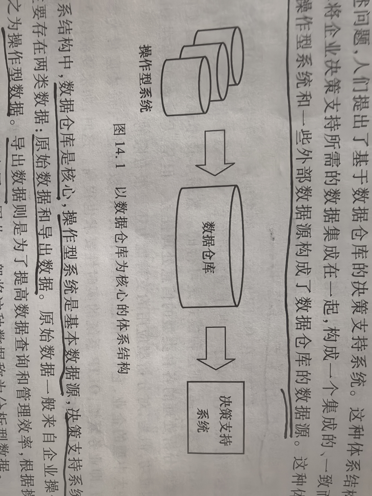

核心：数据仓库；
基本数据源：操作型系统
数据的需求者：决策支持系统

存在两类数据：原始数据和导出数据
原始数据：一般来自企业操作型系统，也称为：操作型数据；
导出数据：是为了提高数据查询和管理效率，根据操作型数据计算得到的数据，常用于支持分析型应用，也称为：分析型数据

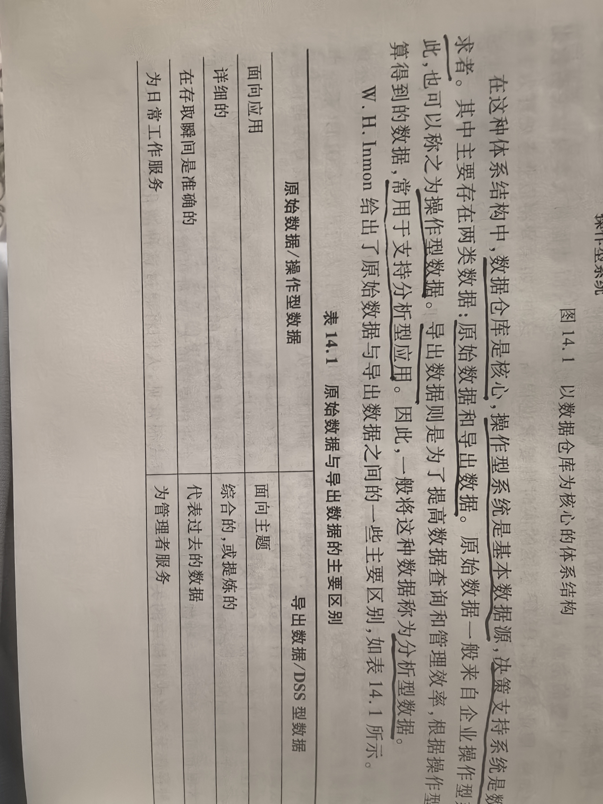
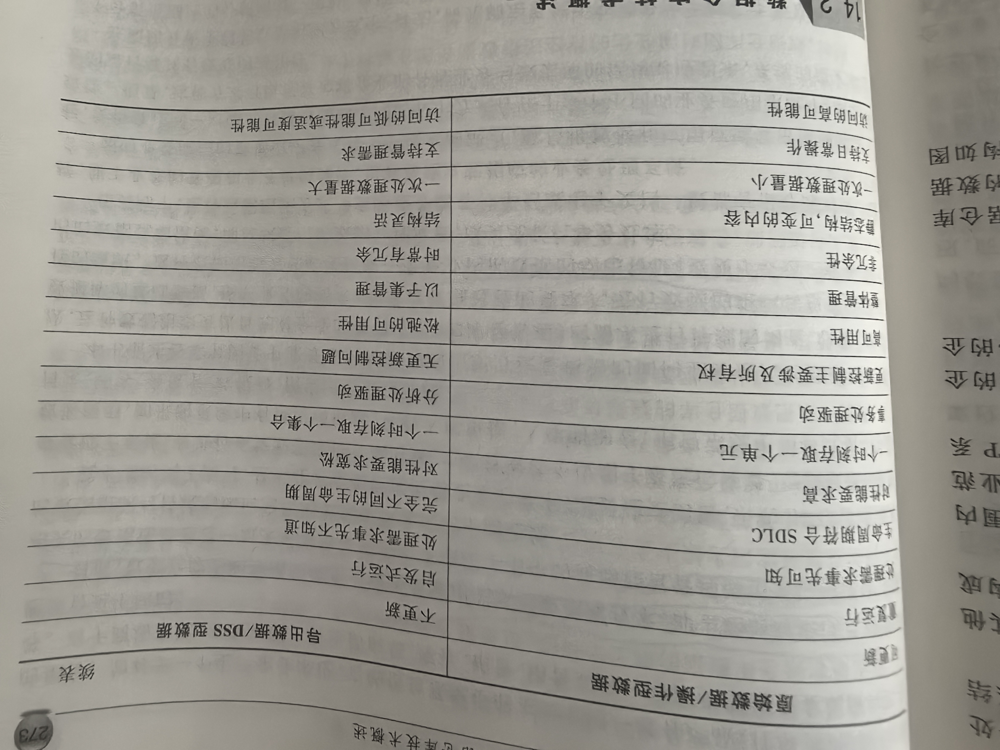

## 14.2 数据仓库技术概述

### 14.2.1 数据仓库的概念与特性

建立数据仓库的主要目的在于根据决策需求对企业的数据采取适当的手段进行集成，形成一个综合的、面相分析的数据环境，用于支持企业的信息型、决策型的分析应用。
数据仓库：是一个面向主题的、集成的、非易失的，且随时间变化的数据集合，用来支持管理人员的决策。

数据仓库特性：
1. 面相主题性；
2. 集成性；
3. 不可更新型；
4. 时间特性。

**1. 主题与面向主题**

主体是一个抽象的概念。

**2. 数据仓库的其他特征**

集成：
集成是数据仓库数据的第二个特征，也是最重要的特性。
当这些数据进入数据仓库时，需要根据数据仓库的模型要求进行转换、重新格式化、重新排列以及汇总等操作。
数据集成功能分成数据抽取、转换、清理（过滤）和装载着四项任务。

不可更新：
数据仓库的第三个重要特性是「数据仓库是不可更新的」。

随时间变化：

### 14.2.2 数据仓库的体系结构与环境

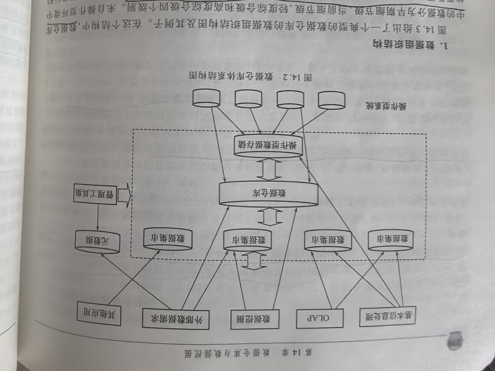

从数据层次角度来看，典型的数据仓库的数据体系结构主要包括操作型数据、操作型存储、数据仓库、数据集市、个体层数据。

从功能结构上看，整个体系中的功能可以分为数据处理、数据管理和数据应用三个层次。
数据处理功能：主要完成个层数据之间的流转功能，主要包括数据集成和数据维护等功能；
数据管理：对数据仓库中的数据进行安全控制、监控和元数据管理等功能；
数据应用：根据企业情况，可已包括各种类型的信息型应用或分析应用。

### 14.2.3 数据仓库的数据组织

**1. 数据组织结构**

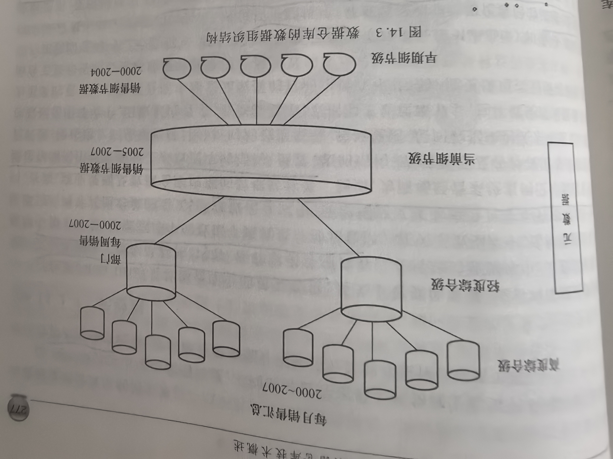

数据仓库中的数据分为早期细节级、当前细节级、轻度综合级和高度综合级四个级别。

**1. 粒度**

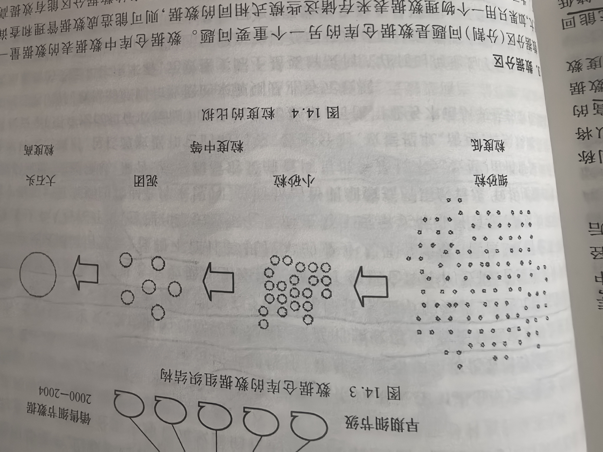

粒度越大，表示综合程度越高；粒度越小，表示综合程度越低。
粒度高的数据是由粒度低的数据综合而成的。

粒度是一个重要的设计问题，它影响到数据仓库的数据量以及系统能回答的查询类型。

多粒度设计，就是针对某一主题，在可用的存储空间中保存粗细程度不同的主题数据，以尽可能满足各种应用的多角度、多层次数据查询要求，同时在总体上提高查询的计算效率。

**3. 数据分区**

对数据进行分区，最常见的是按照「时间标准」来划分。

数据分区的方式可以分成「系统层分区」和「应用层分区」。
系统层分区：是数据库系统提供的机制，各个分区在逻辑上是一个表，在物理上属于不同的分区。
应用层分区：由应用代码实现，不同的分区在逻辑上和物理上都属于不同的表，如何分区由开发者和程序员控制，数据库管理系统并不知道分区间存在什么逻辑关系。

### 14.2.4 元数据

元数据（Meta Data）：数据仓库中的重要数据，是关于数据的数据，或者叫做描述数据的数据。
元数据描述了数据的结构、内容、链和索引等项内容。
在数据仓库中，元数据定义了数据仓库中的许多对象 -- 表、列、查询、商业规划及数据仓库内部的数据转变等。

在数据仓库中，元数据一般分成：技术性元数据、业务性元数据，其内容包一般括：主体描述、外部数据和非结构化数据的描述、层间数据映射关系、逻辑模型定义、集成时的数据转换规则、数据的抽取历史、数据分区定义以及有关存储路径和结构的描述等。
技术元数据：描述关于数据仓库技术细节的数据，这些元数据应用与开发、管理和维护数据仓库；
业务元数据：从业务角度描述了数据仓库中的数据，它提供了介于使用者和实际系统之间的语义层。

### 14.2.5 操作型数据存储

「操作型数据存储（ODS）」：在作为数据源的操作型系统与数据仓库之间存在。
主要包括：
1. 即时（up-to-second）OLAP和全局型OLTP应用

企业级OLTP是指在实际数据处理中，一个事务同时设计多个部门的数据。

ODS中的数据归结出四个基本特点：
1. 面相主题的
2. 集成的
3. 可变的
4. 数据是当前或接近当前的

ODS分成四类：
1. ODS Ⅰ：数据更新频率是秒级；
2. ODS Ⅱ：数据更新频率是小时级；
3. ODS Ⅲ：数据更新频率是天级；
4. ODS Ⅳ：根据数据来源放心和类型区分的。不仅包含来自操作型环境的数据，也包含由数据仓库层和数据集市层的应用反馈给ODS的一些决策结果或一些报表信息。

建立ODS方法也分成自顶向下法和自底向上法。

## 14.3 设计与建造数据仓库

### 14.3.1 数据仓库设计的需求与方法

**1. 数据仓库设计需求**

数据仓库的设计可以分成「数据体系的设计」和「应用体系的设计」。

**2. 设计方法**

数据仓库的建立过程是从企业最基本的分析主体开始，得到一定的应用以后，再根据企业和系统的需要不断建立新的主题，与此同时，尽可能完善现有的主题，最终建立起一个以主题数据集为信息的应用和分析环境。
数据仓库的数据组织是面相主题的。

Inmon认为：数据仓库的建立过程一般采用CLDS（SDLC的逆序）方法。

### 14.3.2 数据仓库的数据模型

数据仓库一般划分为：概念、逻辑和物理这三级数据模型。
与普通数据库系统的区别如下：
1. 数据仓库的数据模型中一般不包含纯操作型数据；
2. 数据仓库的数据模型一般需要扩充关键字结构，在其中加入时间属性；
3. 数据仓库的数据模型中常常需要增加导出数据。

**1. 概念模型**

概念模型是用于描述客观世界中的对象及其属性的一种概念工具

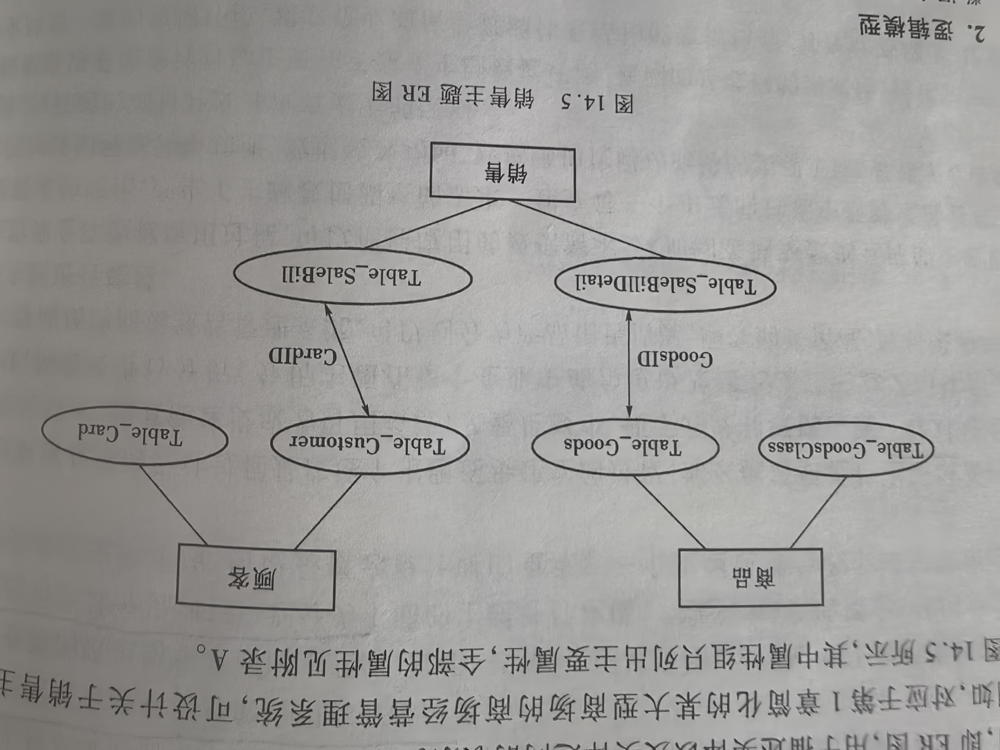

**2. 逻辑模型**

多数还是采用关系型模型作为关系逻辑描述工具

**3. 物理模型**

物理模型就是逻辑模型在具体的数据存储凭条上的物理定义。主要包括「物理存取方式」、「数据存储结构」、「数据存放位置」、「存储分配」

### 14.3.3 数据仓库设计步骤

数据集成（Data Integration）是将源自不同数据源的数据经过抽取、转换、清理、装载等操作载入数据仓库的过程

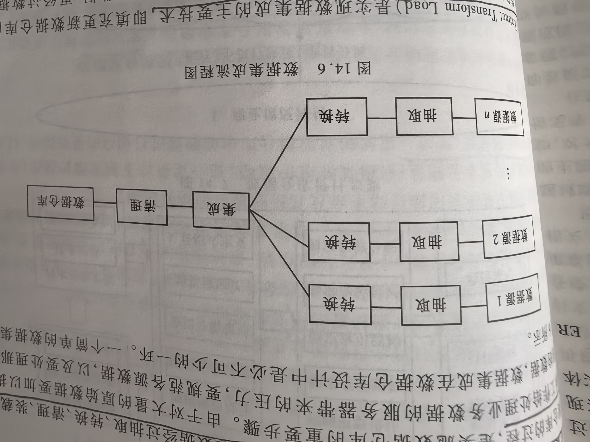

ETL（Extract Transform Load）是实现数据集成的主要技术，即填充更新数据仓库的数据抽取、转换、装载的数据采集过程。

一般常见的方法还有：ELT（Extract Load Transform），越大量的资料、越复杂的转换逻辑越倾向于使用ELT。

数据清洗（Data Cleaning）是一个减少错误和不一致性的过程。

数据仓库设计是以数据仓库的主要数据模型设计和实现为核心，因此数据仓库的设计过程大致可以分为概念模型设计、技术评估与环境准备工作、逻辑模型设计、物理模型设计、数据生成与应用实现以及数据仓库运行与维护。

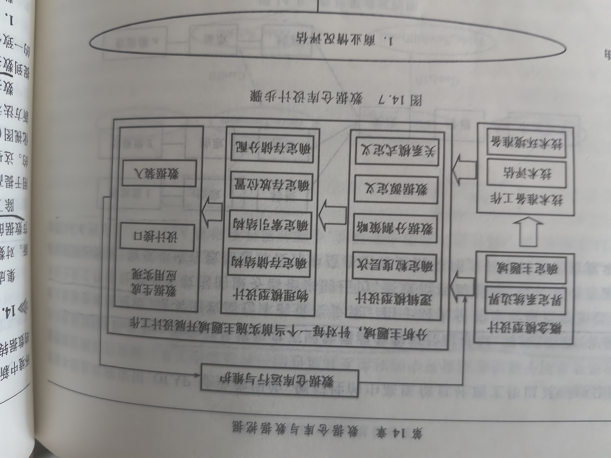
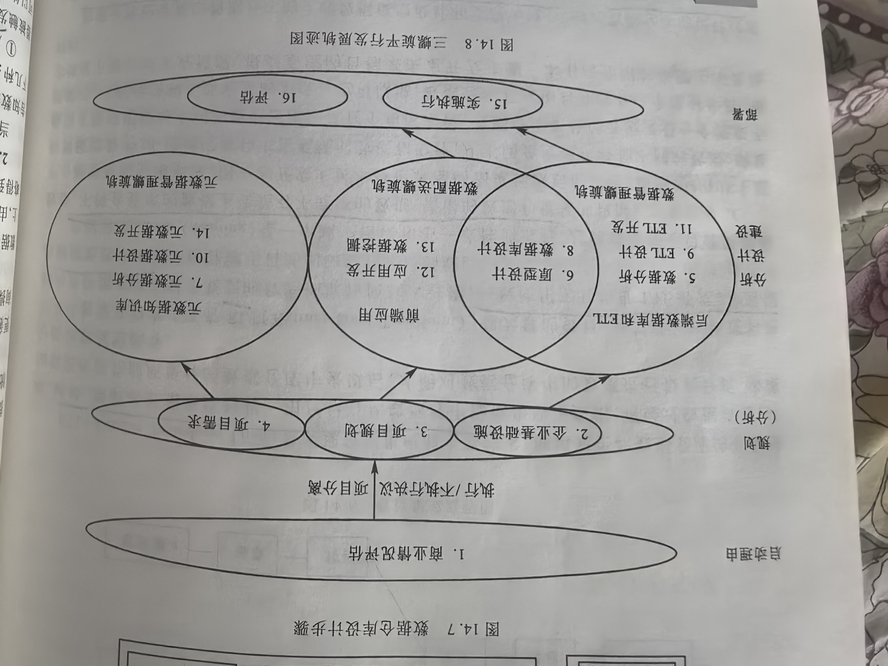1请

## 14.4 数据仓库的运行与维护

### 14.4.1 数据仓库数据的更新维护

对数据仓库主体数据的刷新，主要分为对「细节数据的刷新」和「对导出数据的刷新」。
细节数据的刷新在多数种情况下只需进行数据合并就行。

数据仓库维护的基本思路：
根据某种维护策略，在一定条件下触发维护操作；维护操作捕捉到数据源中的数据变化；通过一定策略对数据仓库中的数据进行相应的更新操作，以保持两者的一致性。

**1. 维护策略**

数据仓库中数据的维护策略分为三种：
1. 实时维护：在数据发生变化时，立即更新数据仓库中数据；
2. 延时维护：在数据仓库中的视图被查询时完成更新；
3. 快照维护：定期对数据仓库进行维护，维护操作的触发条件是时间。

**2. 捕捉数据源的变化**

捕获源数据变化的方法：
1. 触发器：
2. 修改数据源应用程序：
3. 通过日志文件：
4. 快照比较法：

**3. 导出数据的刷新**

数据仓库中导出数据的维护方法：
1. 根据维护对象的数据源对其进行重新计算；
2. 根据数据源的变化量在维护对象原有数据的基础上进行数据添加和修改，即增量式维护。

### 14.4.2 数据仓库监控与元数据管理

**1. 数据仓库监控**

**2. 元数据管理**

一般采用元数据库来存储和管理元数据。
对于复杂的企业数据环境，以安全、高效的方式进行管理和访问的关键是对元数据进行科学有效的管理和元数据库标准化。

标准化的内容：
对所有数据仓库功能的元数据定义出详细的元模型和交换方式，包括技术元数据和业务元数据；定义出所有数据源和数据目标之间的转换规则；对所有的数据仓库运行元素以及主要的分析型或操作型数据模型定义元模型和交换方式。

## 14.5 联机分析处理与多维数据模型

### 14.5.1 OLAP简介

OLAP主要用于支持复杂的分析操作，侧重对决策人员和高层管理人员的决策支持。

### 14.5.2 多维分析的基本概念

数据的多维分析：指针对数据仓库中以多维形式组织起来的数据，从多个角度、不同层次，采用各种数据分析技术，对数据进行剖析，以使用户能从不同角度和不同层次观察和分析数据。

「维」可以看成是人们观察数据的角度。

人们一般用多维视图的概念来描述多维分析系统中用户所看到的数据。
多维模型的数据视图或数据集为多维空间中的点集，这样的数据视图被称为「多维视图」。
多维视图中的属性分为「维属性」和「度量属性」，一个多维视图MDV的模式一般是（d1, d2, ..., dn,m1, m2, ..., mn）,前面n个维属性构成一个多维空间，后面m个度量属性是多维空间中的指标集。例如（地区，月份，销售额）就是一个多维数据模式。

许多主流RDBMS中，已经增加了许多与多维分析有关的一些新对象，如层次结构、层次、维、立方体、物化视图等。

### 14.5.3 多维分析的基本操作
基本操作有：
1. 钻取（Dirll-Down）与卷起（Roll-Up）。钻取与卷起是OLAP分析的两个最基本操作。钻取：指对应于某一维逐步向更细节层方向观察数据，而卷起则相反。
2. 切片（Slice）和切块（Dice）：切片和切块实现局部数据的显示。
3. 旋转：是改变一个报告或页面显示的维方向，通过旋转可以得到不同视角的数据。最简单的旋转就是「数据交叉」。

### 14.5.4 OLAP的实现方式

**1. 基于多维数据库的OLAP（MOLAP）**

核心：多维数据库技术。

**2. 基于关系数据库的OLAP（ROLAP）**

所有基础事实数据及维表都采用关系来表示和存储。

将多维数据库中的多维结构划分为两类：
1. 基础事实表，用来存储事实的度量值及各维的码值；
2. 维表：对于每一个维来说，至少有一个表用来保存该维的描述信息，包括维的层次及成员类别等。

星形模式

雪花模式

**3. 混合型的OLAP（HOLAP）**

将MOLAP和ROLAP结合起来，汲取它们各自的优势。对于操作细节数据使用「关系型数据库」进行管理，对于综合性的数据则使用「多维数据库」实现OLAP操作。
可以看成是对MOLAP的一种改进，但结构较为复杂。

MOLAP具有最好的整体查询性能

## 14.6 数据挖掘技术

数据挖掘可以简单地理解为 从大量数据中提取或挖掘知识。
许多人把数据挖掘视为数据库知识发现（KDD）的同义词，更准确的观点应该是 把数据挖掘视为数据库知识发现的一个步骤。

### 14.6.1 数据挖掘步骤

数据挖掘作为知识发现的过程，由三个阶段组成：数据准备、数据挖掘、结果解释评估

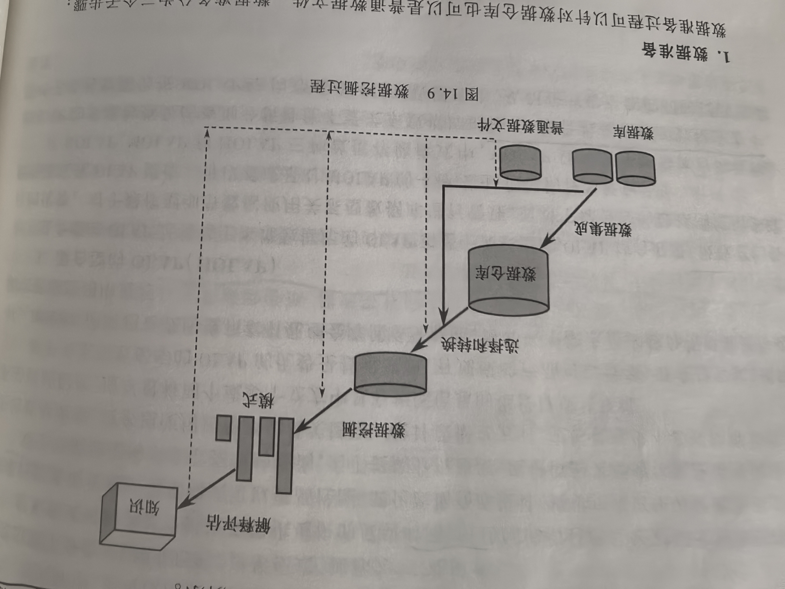

**1. 数据准备**

数据准备分为三个步骤：
1. 数据选取；
2. 数据预处理：
3. 数据变换。

**2. 数据挖掘**

数据挖掘阶段：
1. 确定挖掘的任务或目的；
2. 决定使用什么样的挖掘算法；

**3. 结果解释评估**

常见的数据挖掘任务包括：
1. 分类
2. 估计
3. 预测
4. 相关性分组或关联规则
5. 聚类和
6. 描述

数据挖掘任务分为两大类：
1. 分类预测任务：
从已经分类的数据中学习模型，并使用学习出来的模型去解决新的未分类的数据。

分类预测任务重，需要用到的数据包括：
（1）训练集：用于训练学习算法和建立分类模型
（2）测试集：用于验证所生成的模型是否正确；
（3）验证集：训练集和测试集的每一条数据都为带有给定标签的数据，而验证集为实际应用中的数据，不具有类标签。

常见的分类预测型方法：
1、决策树；
2、神经网络；
3、规则归纳；
4、支持向量机；
5、贝叶斯；
6、粗糙集；
7、回归分析；
8、K-最近邻

2. 描述型任务：
根据数据内部具有的固有联系，生成对数据集中的数据关系或整个数据集的概要描述。

典型的描述型任务包括：
（1）摘要：摘要任务用于对数据集进行总结或摘要式的描述数据或子集；
（2）聚类：把没有预定类别的数据划分为几个合理的类别；
（3）依赖分析：依赖分析任务用于发现数据项之间的关系。

典型的聚类描述型任务：
根据客户的行为特征和基本属性，将不同的客户划分为不同类别的相似群体。

典型的描述型任务方法：
1. 聚类
2. 关联分析

### 14.6.2 关联规则挖掘

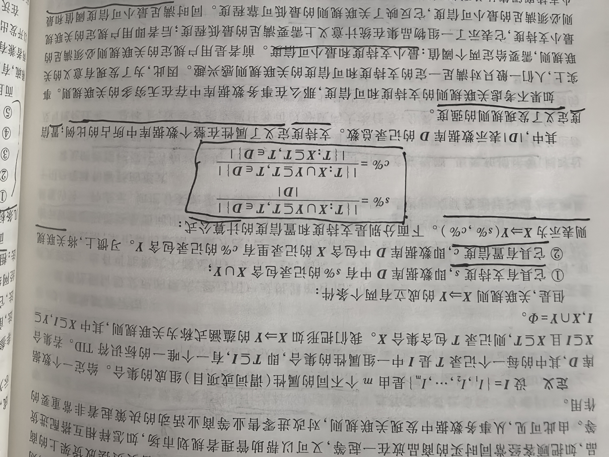

### 14.6.3 分类挖掘

预测：指从历史数据记录中推导出对给定数据的推广描述，从而达到对未来数据进行预测的目的。

分类的过程步骤：
1. 通过一直数据集（训练集），建立分类函数，构造分类器；
2. 利用所获得的分类函数对未知类别标记的数据项进行分类操作。

分类器的构造方法有统计方法、机器学习方法、神经网络方法。
统计方法：包括贝叶斯法和非参数法，对应的知识表示则为判别函数和原型事例；
机器学习方法：包括决策树法和规则归纳法，前者对应的表示为决策树或判别树，后者则一般为产生式规则；
神经网络方法：主要是BP算法，它的模型是一种由代表神经元的结点和代表连接权值的边组成的体系结构 -- 前向反馈神经网络模型。

从本质上来说，BP算法是一种非线性判别函数。
另外，最近兴起的新方法：粗糙集，其知识表示是产生式规则。

对各种分类器的评价标准：
1. 预测准确率。指模型能够正确预测未知数据类别的能力；
2. 速度。指构造和使用模型时的计算效率；
3. 健壮性。指在数据带有噪声或有数据遗失的情况下，模型扔能进行正确预测的能力；
4. 可扩展性。指对处理大量数据并构造向应有效模型的能力；
5. 易理解性。指所获模型提供的可理解程度。

### 14.6.4 聚类挖掘

聚类：就是将一个数据集中的数据进行分组，使得每一组内的数据尽可能的相似而不同组间的数据尽可能不同。

聚类的方法：
1. 统计方法
2. 机器学习方法
3. 神经网络方法
4. 面相数据库的方法

在统计方法中，聚类称为「聚类分析」，它是多元数据分析的三大方法之一。
在机器学习中，聚类称为「无监督（或无教师）归纳」。
在神经网络中，有一类无监督学习方法，即「自组织神经网络方法」，如Kohonen自组织特征映射网络、竞争学习网络等。在数据挖掘领域中，神经网络聚类方法主要是自组织特征映射方法。

### 14.6.5 时间序列分析

所谓时间序列就是用时间排序的一组随机变量。
时间序列分析也可以称为「数据演变分析」，它能描述行为随时间变化的对象的规律或趋势，并对其进行建模。

对于时间序列的数据类型，时间序列从不同角度可分为：
1. 一元时间序列和多元时间序列；
2. 等间隔时间序列和不等间隔时间序列；
3. 平稳时间序列和非平稳时间序列。

时间序列分析 设计很多方面：时间序列预测，时间序列数据变换，时间序列聚类/分类分析等。