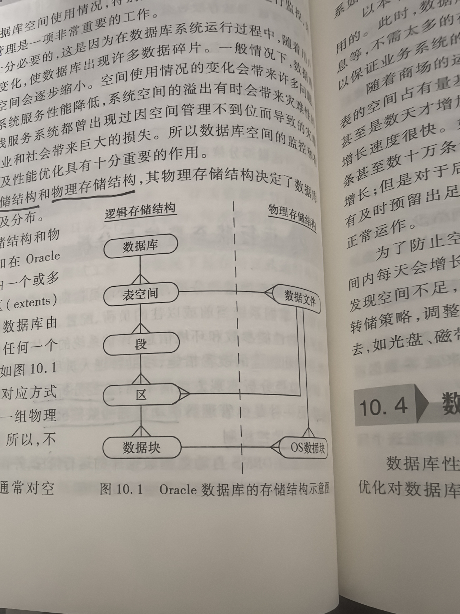

# 10 数据库运行维护与优化

## 专业术语

| 中文 | 英文 | 简称 | 说明 |
| --- | --- | --- | --- |
|  |  |  |  |

## 10.1 数据库运行维护基本工作

运行维护阶段任务：保证数据库系统安全、可靠且高效率地运行

在数据库系统运行过程中必须不断地对其进行监控、评价、调整与修改，以保证数据库系统正常和高效地运行

维护工作包括：数据库的转储和恢复、数据库的安全性和完整性控制、数据库性能的监控分析和改进、数据库的重组和重构

## 10.2 运行状态监控与分析

监控分析机制：
1. 自动监控机制
2. 管理员手动实施的监控机制
3. 对数据库架构体系的监控
4. 对数据库性能的监控

## 10.3 数据库存储空间管理

数据库的存储结构一般分为：
1. 逻辑存储结构
2. 物理存储结构

## 10.4 数据库性能优化

数据库性能优化一般可以从数据库运行环境、数据库参数调整、模式调整、数据库存储优化、查询优化几个方面考虑

### 10.4.1 数据库运行环境与参数调整

**1. 外部调整**
1. CPU
2. 网络

**2. 调整内存分配**
**3. 调整磁盘I/O**
**4. 调整竞争**
采用方法：
1. 修改参数以控制链接到数据库的最大进程数
2. 减少调度进程的竞争
3. 减少多线程服务进程竞争
4. 减少重做日志缓冲区竞争
5. 减少回滚段竞争

### 10.4.2 模式调整与优化

常用的饭规范化方法有增加派生冗余列、增加冗余列、重新组表、分割表、新增汇总表等方法

**1. 增加派生冗余**
指表中增加的列由表中的一些数据项经过计算生成

**2. 增加冗余列**
指在多个表中增加具有相同语义的列，它常用来在查询时避免链接操作

**3. 重新组表**
用户经常查看的某些数据是由多个表连接后才能得到，就可以考虑先把这些数据重新组成一个表

**4. 分割表**
1. 水平分割：根据数据行的使用特点进行分割，分割之后所得到的所有表的结构都相同，而存储的数据不同
2. 垂直分割：根据数据列的特点进行分割，分割之后所得到的所有表这哪个输了都含有主码列外其余列都不相同

**5. 新增汇总表**

### 10.4.3 存储优化

**1. 物化视图**
物化视图是包括一个查询结果的数据库对象。
物化视图还可以进行远程数据的本地复制，此时物化视图的存储也可以称为「快照」。主要用于实施数据库间的同步
特别使用抽取大数据量表中某些信息以及分布式环境中跨节点进行多表数据连接的场合

**2. 聚集**
聚集是物理存储表中数据的可选择的方法。
一个聚集是一组表，可将经常一起使用的具有同一公共列值的多个表中的数据行存储在一起，由他们的公共列构成聚集码。
多表中相关的列称为「聚集码」

### 10.4.4 查询优化

**1. 合理使用索引**
索引的物理设计决策设计一下几类问题：
1. 是否为一个属性建立索引
2. 在哪些属性上建立索引
3. 是否建立聚簇索引：聚簇索引最适合用于范围查询
4. 使用散列索引还是数索引：B+树索引支持作为搜索码的属性上的等值查询和范围查询。散列索引适用于等值查询

索引的使用要恰到好处，使用原则如下：
1. 经常在查询中作为条件被使用的列，应为其建立索引
2. 频繁进行排序或分钟的列，应为其建立索引
3. 一个列的值域很大时，应为其建立索引
4. 如果待排序的列有多个，应在这些列上建立复合索引
5. 可以使用系统工具来检查所以的完整性，必要时进行修复。另外，当数据库表更新大量数据后，删除并重建索引也可以提高查询速度

索引调整与修改主要基于以下一些原因：
1. 由于缺少索引，某些查询语句执行时间过长
2. 某些索引自始至终没有使用，而索引占用了较多的磁盘空间
3. 某些索引建立在被频繁改变的属性上，导致系统的开销过大

调优的目的是动态地评估需求

**2. 避免或简化排序**

当能够利用索引自动以适当的次序产生输出时，优化器是可以避免不必要的排序步骤。一下是一些影响因素
1. 由于现有的索引的不足，导致排序时索引中不包括一个或几个待排序的列
2. Group By或Order By子句中列的次序与索引的次序不一样
3. 排序的列来自不同的表

**3. 消除对大型表数据的顺序存取**
**4. 避免复杂的正则表达式**
**5. 使用临时表加速查询**
**6. 用排序来取代非顺序磁盘存取**
**7. 不充分的连接条件**
**8. 存储过程**
**9. 不要随意使用游标**
**10. 事务处理**

### 10.4.5 SQL server性能工具

1. SQL server Profilter
2. 数据库引擎优化顾问