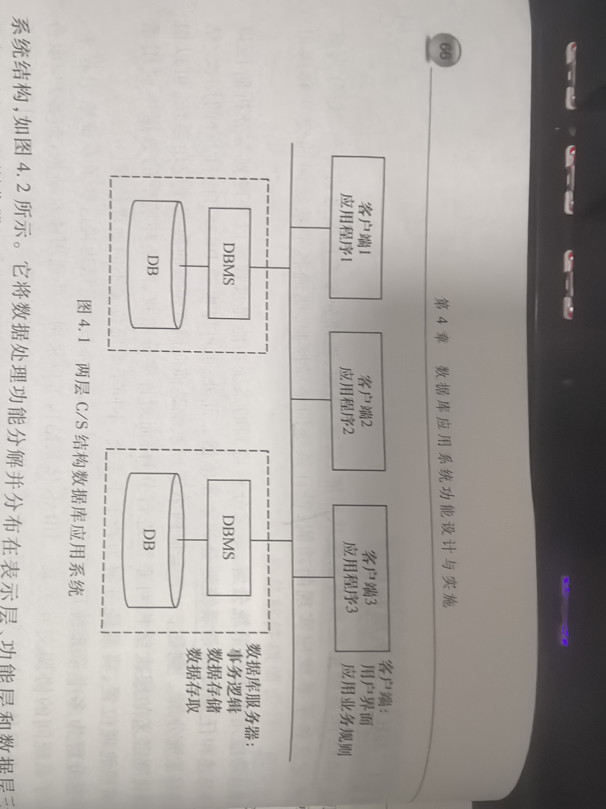

## 专业术语

| 中文 | 英文 | 简称 | 说明 |
| --- | --- | --- | --- |
|  |  |  |  |

## 4.1 软件体系结构与设计过程

### 4.1.1 软件体系结构

软件体系结构（又称：软件架构）：= { 构件，连接件， 约束 }
构件：组成系统的具有一定独立功能的不同粒度的程序模块、独立程序或软件子系统，是组成软件的系统元素；
连接件：将不同的构件连接起来，表示构件间的相互作用，如信号量的传递、功能和方法的调用、数据传送和转换、构件间的同步等；

构件可以是过程调佣、管道、远程过程调用等；
约束一般为对象链接是的规则，或指明了构件连接的条件。

软件体系结构的风格和类型：
分层体系结构；
模型-视图-控制器（MVC）体系结构；
客户/服务器体系结构

### 4.1.2 软件设计过程

软件开发组成 = 设计 + 实现 + 测试
设计又包括：概要设计 + 详细设计

软件设计阶段产生：系统的总体结构设计（或称体系结构设计）、系统的过程设计、系统的数据设计；
总体结构设计：旨在确定组成软件系统的各主要部件及其相互间关系
过程设计：完成对每一部分的过程化描述；
数据设计：定义了为实现软件所需要的数据结构

软件设计过程中应遵循的原则：
设计应与软件需求保持一致，设计的软件结构应支持模块化、信息隐藏、抽象与逐步求精等

从工程管理角度，软件设计课分为概要设计和详细设计

概要设计：根据需求确定软件和数据的总体框架；
详细设计：将其进一步细化成软件的算法表示和数据结构

**1. 概要设计**

概要设计任务：建立软件系统的总体结构和模块间的关系，定义个功能模块的接口，设计全局数据库或数据结构，规定设计约束，指定测试计划。

好的概要设计要求：良好的总体结构，功能模块间较低的耦合度和功能模块内较高的内聚度，并尽量降低模块接口的复杂性

**2. 详细设计**

概要设计侧重于模块的外部功能描述和模块间接口关系
详细设计则是细化概要设计产生的功能模块，形成可编程的程序模块。

软件设计可选用 结构化设计方法（面向数据流的设计方法）、面相对象设计方法、面相数据设计方法

**3. 关于软件总体设计**

概要设计的目标：产生软件总体结构和软件功能模块

概要设计分为两个步骤：
1. 软件总体结构设计
2. 将每个子系统进一步划分为功能模块，定义各功能模块的数据结构、相互间交互关系。

大型复杂系统层次结构：系统-子系统-模块-子模块

## 4.2 DBAS总体设计

原则：自上而下、循序渐进、逐步求精

DBAS设计：结构设计、过程设计、数据设计

### 4.2.1 DBAS体系结构设计

DBAS体系结构是将系统从功能、层次/结构、地理分布等角度进行分解，划分为多个子系统，定义各子系统应实现的功能。
设计系统的全局控制，明确各子系统间的交互和接口关系

**1、 客户/服务器（C/S）体系结构**

**2、 浏览器/服务器（B/S）体系结构**

### 4.2.2 DBAS软件总体设计

DBAS软件包括操作系统、数据库管理系统、开发环境、中间件和应用软件
应用软件分为：数据库事务和应用程序
数据库事务通过对数据库的直接操作实现数据管理和数据处理功能
应用程序：
一方面可以与数据库事务相互协调合作，对数据库中的应用数据进行进一步加工处理
另一方面从这些数据中抽取新的信息，以实现复杂的数据处理功能

应用软件总体设计得到的系统总体结构和分层模块结构可以用模块结构图表示

模块结构图主要关心模块的外部特性。
模块结构图 = 模块、调用、数据、控制、转接 无中基本符号组成

应用软件总体设计之后的设计工作分别是：数据库事务和应用程序的概要设计和详细设计

### 4.2.3 软硬件选型与配置设计

DBAS总体设计阶段需要对系统硬件平台和存储设备、操作系统、数据库管理系统等作出合理选择，并进行初步配置设计

软硬件选型设计的内容：
1. 网络及网络设备选型
2. 数据出处设备及备份方案制定
3. 应用服务器、web服务器选型
4. 确定系统终端软件环境
5. 确定软件平台及开发语言、工具
6. 系统中间件及第三方软件选型

进行软硬件选型及配置设计需要考虑的因素
1. 数据规模
2. 系统性能
3. 安全可靠性
4. 用户需求
5. 项目预算情况

### 4.2.4 业务规则初步设计

使用流程图

## 4.3 DBAS功能概要设计

DBAS功能概要设计的原则：逐步求精、模块化、信息隐藏和功能细化
根据DBAS需求分析阶段得到的「系统功能」和「业务规则」描述，在总体设计结果基础上，将DBAS应用软件进一步细化为模块/子模块，组成应用软件的系统 - 子系统 - 模块 - 子模块层次结构，并对系统、子系统、模块、子模块等系统元素从结构、行为和数据三方面进行设计。

DBAS系统可划分为四个层次实现：

### 4.3.1 表示层概要设计

表示层概要设计的任务：进行人机界面设计

人机界面设计原则：

1. 用户应当感觉系统的运行始终在自己的控制之下；
2. 当系统发生错误或程序运行事件较长时，系统应反馈信息，并有上下文感知的帮助功能；
3. 可以容忍用户在使用过程中发生的各种操作错误，并能够快速的恢复；
4. 用户界面应该遵循一定标准和常规；
5. 用户界面应采取灵活多样的数据输入方式，尽量减少用户的输入负担；
6. web界面，应具有简洁性

### 4.3.2 业务逻辑层概要设计 

业务逻辑层概要设计任务：梳理DBAS的各项业务活动，将其表示为各种系统构件（如：类、模块、组件等）；
业务逻辑层概要设计包括：结构、行为、数据、接口、故障处理、安全设计、系统维护与保障

业务逻辑层进行模块划分原则：高内聚、松耦合
具体体现：
1. 构件本身应有相关性很强的代码组成，一个构件或模块只负责一项任务。单一原则；
2. 组成系统业务逻辑层的各个构件应具有「独立的功能」，并且最大限度地减少与其他构件功能重叠；
3. 构件间的接口应尽量简单明确；
4. 如果某两个构件间的关系较为复杂，应考虑进一步进行模块划分；
5. 如果构建过于复杂，可考虑将其细分

### 4.3.3 数据访问层概要设计

数据访问层概要设计任务：针对DBAS的数据处理需求设计用于操作数据库的各类事务。
事务：是数据库系统中的一个逻辑数据处理单元，其中包含了一些列数据操作的集合。

事务的设计可分解为「概要设计」和「详细设计」
事务概要设计核心：辨识和设计失误自身的事务处理逻辑

设计失误处理逻辑的设计过程：
1. 从数据流图中识别出该事务对应的子数据流图
2. 确定子数据流图中的数据流类型，划定流界
3. 将子数据流图映射为失误的结构和处理流程，即失误处理逻辑（或事务业务规则）；
4. 修正和细化事务设计，识别事务所访问的数据库对象和数据库用户
5. 确认实物概要设计和数据库设计

完整失误概要设计包括的信息：
事务名称、事务所访问的关系表及关系属性、事务处理逻辑、事务用户

检查关系表对数据库事务的支持性步骤：
1. 对每一个事务，根据需求分析阶段的事务分析，列出该事务所访问的各个数据项
2. 列出事务访问的数据项所在的关系表和对应的关系属性
3. 如果事务访问的数据项同时出现在多个表中，检查这些关系表间的关联关系，如主码/外码关联
4. 检查是否存在某些事务，这些事务所访问的一些数据项未出现在任何关系表中。

## 4.4 DBAS功能详细设计
              
### 4.4.1 表示层详细设计

人机界面设计采用：原型迭代法

原型迭代法的步骤：

1. 初步设计：从用户人机交互需求出发，设计「人机交互命令系统」，并对其进行优化
2. 用户界面细节设计：在命令树基础上，设计命令系统的具体实现方式，命令系统实现可采用「命令行、菜单、按钮、Web界面」等多种方式
3. 原型设计与改进：构造一个人机界面原型系统

### 4.4.2 业务逻辑层详细设计

业务逻辑层详细设计任务：根据概要设计中定义的各程序模块功能和输入输出数据需求，结合具体的程序设计环境和机制，设计个模块的内部处理流程和算法、具体数据结构、对外详细接口等，是对概要设计的细化。
描述DBAS对用户业务的详细实现逻辑方法：UML的类图、活动图、协作图

## 4.5 应用系统安全架构设计

### 4.5.1 数据安全设计

数据安全设计考虑的点：
1. 安全性保护：防止非法用户对数据库的非法使用，以避免数据的泄密、篡改或破坏
2. 完整性保护：保证数据源的正确性和一致性
3. 并发控制：保证多个用户能共享数据库，并维护数据的一致性
4. 数据库的备份与恢复：在系统失效后的数据库恢复，配合定时备份数据库，是数据库不丢失数据
5. 数据加密传输：将一些高密级的敏感数据通过一定的加密算法加密后传输

**1. 数据库的安全性保护**

主要的保护方式有：
1. 用户身份鉴别
2. 权限控制
3. 视图机制

**2. 数据库完整性保护**

数据库完整性保护：数据库中数据的正确性、一致性和相容性

保证数据库中数据的完整性方法之一：设置完整性检查（即对数据库中的数据设置一些约束条件）
完整性约束条件的作用对象分为：列、元祖和关系；
对列的约束：对其值类型、范围、精度、排序等的约束条件；
对元祖的约束：对记录中各个属性之间的联系的约束条件；
对关系的约束：对若干记录间、关系集合上一级关系之间联系的约束条件

**3. 数据库的并发控制**

并发访问：数据库管理系统可以同时接纳多个事务，事务可以在时间上重叠执行

数据库并发控制的方法：封锁技术

封锁技术包括：排它锁（x锁）、共享锁（s锁）

避免死锁可考虑的原则：
1. 按同一顺序访问资源
2. 避免事务中的用户交互
3. 采用小事务模式，尽量缩短事务的长度，减少占有锁的时间
4. 尽量使用记录级别的锁（行锁），少用表级别的锁
5. 使用绑定连接，使同一应用程序锁打开的两个或多个链接可相互合作

**4. 数据库的备份与恢复**

数据备份与恢复策略：
1. 双机热备
2. 数据转储
3. 数据机密存储

**5. 数据加密传输**

数据加密传输手段：
1. 数字安全证书
2. 对称密钥加密
3. 数字签名
4. 数字信封

### 4.5.2 环境安全设计

需要考虑哪些软硬件环境的安全？
1. 漏洞与补丁：保障操作系统运行的稳定是DBAS系统运行安全的基础
2. 计算机病毒防护：
    > 病毒防护手段：安装杀毒软件，定期查杀病毒；计算机实时监控；
3. 网络环境安全：防火墙；入侵检测系统；网络隔离
4. 物理环境安全：条件允许，建议设立专门的空间用于防止服务器、存储设备、网络设备等硬件设备；可采用UPS（不间断电源）来解决设备用电安全方面的问题

### 4.5.3 制度安全设计

管理层面安全措施：用行政管理、法制保证和其他物理措施等防止安全事故的发生

## 4.6 DBAS实施

工作内容：
1. 创建数据库
2. 转载数据
3. 编写和调试应用程序
4. 数据库试运行

### 4.6.1 创建数据库

创建数据库时考虑的因素：
1. 初始空间大小
2. 数据库增量大小
3. 访问性能

### 4.6.2 数据装载

数据转载步骤：
1. 筛选数据
2. 转换数据格式
3. 输入数据
4. 校验数据

### 4.6.3 编写与调试应用程序

测试团队对系统进行集成调试，包括功能测试、性能测试、系统联调等

### 4.6.4 数据库系统试运行

试运行的主要目的：对数据库系统的功能和性能进行进一步的测试，找出其中的不足，加以完善改进。

**1. 功能测试**

实际运行数据库的应用程序，执行对数据库的各种操作。

**2. 性能测试**

测量系统的性能指标，分析是否符合设计目标

